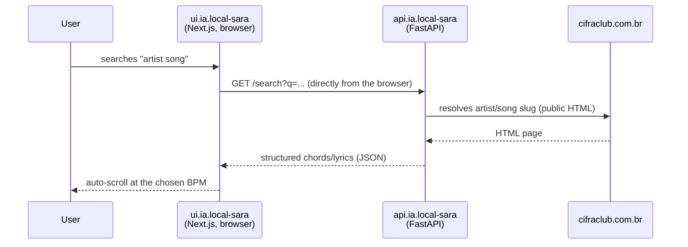

# Sara

An ad-free chords-and-lyrics player: search a song, follow the lyrics and
chords with BPM-driven auto-scroll, build a playlist, and play through it
song after song without ever touching the mouse to scroll.

## Components

| Repo | Role | Stack |
|---|---|---|
| `ui.ia.local-sara` | Player — search, chord/lyric viewer, playlist | Next.js (App Router) |
| `api.ia.local-sara` | Resolves artist/song on Cifra Club and returns structured chords/lyrics as JSON | FastAPI |
| `gitops.local-sara` | Deploys both components | Helm (generic chart) + ArgoCD |

## Data flow

Unlike teupadel.com, the UI calls the API **directly from the browser**
(CORS enabled) instead of proxying through a server-side route —
`api.ia.local-sara` holds no secret, so that extra hop wouldn't buy any
security benefit here.

## Why scraping, not a search API

Cifra Club doesn't expose a public search API. `api.ia.local-sara` resolves
artist/song by parsing public HTML pages (not blocked by `robots.txt`),
with a small in-memory TTL cache to avoid re-fetching the same song
repeatedly.

## Playlist

Stored entirely in the browser's `localStorage` — there's no backend
persistence for the playlist. No user accounts, no authentication: it's a
personal-use tool.

## Networking

Shares the `local.cmoreira.dev` hostname (Gateway
`nginx-gateway-cmoreira-dev`) with other internal tools, distinguished by
path prefix:

| Path | Component |
|---|---|
| `local.cmoreira.dev/sara` | `ui.ia.local-sara` (prefix preserved — Next.js `basePath`) |
| `local.cmoreira.dev/sara/api` | `api.ia.local-sara` (prefix stripped before reaching the container) |

See [Networking & Ingress](../architecture/networking.md) for the shared-path
pattern and how the Gateway API resolves the prefix conflict between the
two.

## Secrets

None — `api.ia.local-sara` has no API key to manage, and the UI's
configuration (`NEXT_PUBLIC_API_URL`) is set at build time, not a runtime
secret.

## Namespace and registry

Both components run in the `sara` namespace, with images published to ECR
(`<account>.dkr.ecr.us-east-1.amazonaws.com/sara/api` and `.../sara/ui`) by
the pipeline described in [Build & Registry](../cicd/build-registry.md).
