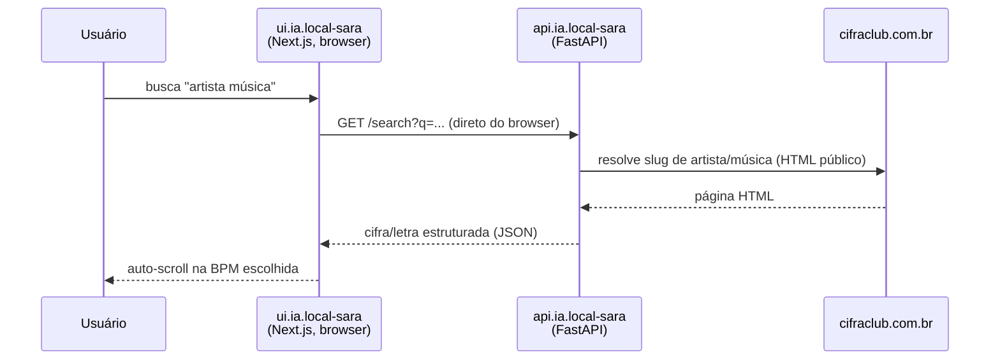

# Sara

Player de cifras e letras sem anúncios: busca uma música, acompanha o texto e
os acordes com auto-scroll ajustado por BPM, monta uma playlist e toca uma
música após a outra sem precisar tocar no mouse para rolar a tela.

## Componentes

| Repo | Papel | Stack |
|---|---|---|
| `ui.ia.local-sara` | Player — busca, visualizador de cifra/letra, playlist | Next.js (App Router) |
| `api.ia.local-sara` | Resolve artista/música no Cifra Club e devolve cifra/letra estruturada em JSON | FastAPI |
| `gitops.local-sara` | Deploy dos dois componentes | Helm (chart genérico) + ArgoCD |

## Fluxo de dados

Diferente de teupadel.com, a UI chama a API **diretamente do browser** (CORS
habilitado) em vez de proxear via rota server-side — `api.ia.local-sara` não
guarda nenhum segredo, então esse salto extra não traria benefício de
segurança aqui.

## Por que scraping, e não uma API de busca

O Cifra Club não expõe uma API pública de busca. `api.ia.local-sara` resolve
artista/música fazendo parsing de páginas HTML públicas (não bloqueadas por
`robots.txt`), com um pequeno cache TTL em memória para evitar buscar a mesma
música repetidamente.

## Playlist

Guardada inteiramente no `localStorage` do browser — não há backend de
persistência para playlist. Nenhuma conta de usuário, nenhuma autenticação: é
uma ferramenta de uso pessoal.

## Rede

Compartilha o hostname `local.cmoreira.dev` (Gateway `nginx-gateway-cmoreira-dev`)
com outras ferramentas internas, diferenciado por prefixo de path:

| Path | Componente |
|---|---|
| `local.cmoreira.dev/sara` | `ui.ia.local-sara` (prefixo preservado — `basePath` do Next.js) |
| `local.cmoreira.dev/sara/api` | `api.ia.local-sara` (prefixo removido antes de chegar no container) |

Ver [Rede & Ingress](../architecture/networking.md) para o padrão de path
compartilhado e como a Gateway API resolve o conflito de prefixo entre os dois.

## Segredos

Nenhum — `api.ia.local-sara` não tem chave de API para gerenciar, e a
configuração da UI (`NEXT_PUBLIC_API_URL`) é definida em build-time, não é um
segredo de runtime.

## Namespace e registry

Ambos os componentes rodam no namespace `sara`, com imagens publicadas no ECR
(`<conta>.dkr.ecr.us-east-1.amazonaws.com/sara/api` e `.../sara/ui`) pelo
pipeline descrito em [Build & Registry](../cicd/build-registry.md).
