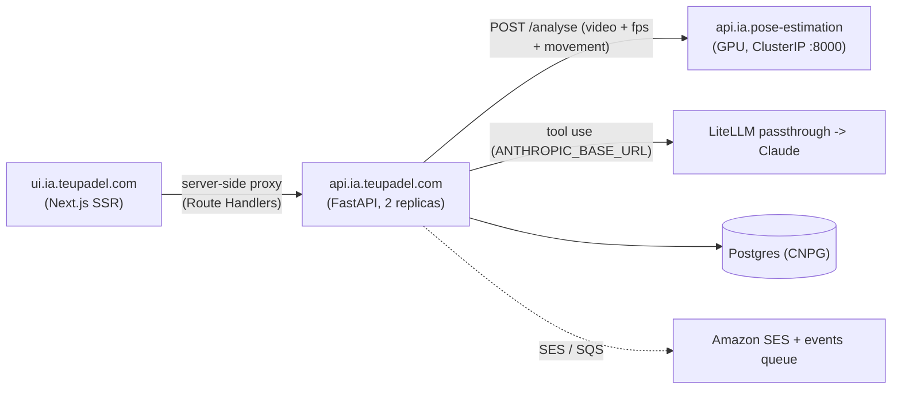

# teupadel.com — API (api.ia.teupadel.com)

!!! warning "Source of truth: the repo code; update this page on any functional change"
    This page describes `api.ia.teupadel.com` (FastAPI). If the code and this page disagree, the
    code wins. After any functional change to the API, update this page **and** the PT version
    (`teupadel-api.md`) in the same piece of work. The short working rules (gotchas,
    prohibitions) live in the repo's `CLAUDE.md`.

The API orchestrates teupadel.com: it receives the video, calls the pose processor
([teupadel-processor](teupadel-processor.md)), applies quality gates, asks Claude for the report
(tool use), stores the result in Postgres, and handles accounts, bolas, referrals, telemetry
and the waitlist. It has no UI. Product overview, data flow and networking are in
[teupadel.com](teupadel.md).



The API has **no public hostname**: only the UI talks to it, over the internal Service
`teupadel-api.teupadel.svc.cluster.local`, through proxy Route Handlers
(`src/app/{analyse,telemetry,waitlist,api}` in the UI repo). This includes the Google redirect
(`redirect_uri = {FRONTEND_URL}/api/auth/callback/google`).

## Endpoint contract

Business errors carry a text `detail`; the stable codes for the UI are `login_required` and
`captcha_failed`.

| Route | Auth | Summary |
|---|---|---|
| `GET /health` | no | `{"status": "ok"}` (probes and `HEALTHCHECK`) |
| `POST /analyse` | session | Creates the (asynchronous) analysis and charges 1 bola. See below. |
| `GET /reports`, `GET /reports/{id}`, `DELETE /reports/{id}` | session | Report history. See "Asynchronous reports". |
| `POST /auth/magic-link`, `GET /auth/verify`, `GET /auth/google`, `GET /auth/callback/google`, `POST /auth/logout` | mixed | Unified login. See "Authentication". |
| `GET /me`, `DELETE /me` | session | Account and GDPR. |
| `GET /me/progress` | session | Score evolution per movement and overall. See "Scores". |
| `POST /telemetry/events` | no | Product events from the browser (via the UI proxy). |
| `POST /waitlist` | no | Interest capture on the Pricing page. |

### POST /analyse

`multipart/form-data`:

- `file`: video `mp4`/`mov`/`avi`/`mkv`, max 100 MB (a `Content-Length` above 100 MB plus 2 MB of
  margin is rejected up front; extension validated with `.lower()`).
- `fps` (query): integer 1-10, default 2 (out of range, FastAPI answers `422`).
- `lang` (query): `en` | `pt-pt` | `pt-br`, default `pt-pt` (`400` otherwise). Only changes the language
  of the Claude-generated text; JSON keys do not change. Must stay in sync with the locales in
  `ui.ia.teupadel.com/src/i18n/routing.js`.
- `movement` (query, optional): `serve` | `forehand` | `backhand` | `volley` | `smash` (`400` otherwise).
  Forwarded to the processor. The UI sends it when the user picks the stroke (`UploadZone` radiogroup);
  without it the processor auto-detects, which is experimental (see
  [teupadel-processor](teupadel-processor.md)).

**`202` response:** `{"report_id": "<uuid>", "status": "processing", "bolas": <balance after the charge>}`.

Synchronous errors: `413` (video too large), `400` (extension, `lang`, `movement`, invalid
`Content-Length`), `422` (`fps`), `401 login_required` (no valid session), `402` (no bolas), `429` (server
busy: the pod already runs `MAX_INFLIGHT_ANALYSES` jobs), `500` (database not configured). Processor or
Claude failures do **not** come back in this response: the job closes the report as `failed` with a
`failure_reason` (see below).

The job result (stored in `reports.result` and returned by `GET /reports/{id}`) has two shapes.

**`analysis_possible: true`:**

```json
{
  "success": true,
  "analysis_possible": true,
  "metadata": { "total_frames": 72, "frames_with_pose": 68, "fps_extracted": 6, "processing_time_s": 13.47 },
  "pose_frames": { "fps_extracted": 6, "frames": [ { "t": 0.166, "points": [ { "n": "nose", "x": 0.512, "y": 0.221 } ] } ] },
  "report": {
    "resumo_geral": "...",
    "pontos_positivos": [ { "titulo": "Direita", "texto": "...", "golpe_index": 1, "tempo_s": 3.2 } ],
    "pontos_a_melhorar": [ { "titulo": "Remate", "texto": "...", "golpe_index": 2, "tempo_s": 8.1 } ],
    "proximo_treino": { "golpe_index": 2, "passos": ["..."], "momentos": { "preparacao_s": 7.5, "impacto_s": 8.1, "terminacao_s": 8.6 } },
    "golpes_detectados": [ { "golpe_index": 1, "nome": "forehand", "movement_source": "user_provided", "movement_warning": null } ]
  }
}
```

**`analysis_possible: false`** (no `report` or `pose_frames`; Claude is not even called):

```json
{ "success": true, "analysis_possible": false, "reason": "no_stroke_detected", "metadata": { "total_frames": 72, "frames_with_pose": 12, "fps_extracted": 2, "processing_time_s": 13.47 } }
```

Quality gates (`_analyse_core`, in order), all before spending the LLM call:

| `reason` | Condition |
|---|---|
| `no_stroke_detected` | processor `stroke_analysis` is empty |
| `low_pose_detection` | `frames_with_pose / total_frames` below `MIN_POSE_DETECTION_RATE` (0.30) |
| `low_stroke_confidence` | every stroke failed the per-stroke gate (`_filter_quality_strokes`): fewer than `MIN_STROKE_FRAMES` (5) frames with pose within `start_s..end_s`, or `classification_confidence` below `MIN_STROKE_CONFIDENCE` (0.4) when the processor sends it. A failing stroke is simply dropped; this `reason` only appears when none is left. |

The UI shows fixed, translated tips based on `reason`, never LLM text.

Report details:

- `golpe_index` (1-based, in the order strokes survive the gate) and `tempo_s` tie each point to a moment in
  the video (the UI's "Ver no vídeo" link). Model values are validated/clamped against the stroke's real
  window in `_normalize_report`; a missing, wrong-typed or out-of-window value is replaced by the real
  `impact_s` (never a silent `0.0`). `proximo_treino.momentos` never comes from the model.
- `golpes_detectados` is built by the API from `stroke_analysis`, never by the LLM; the LLM only receives
  `movement_warning` as a tone instruction (`prompts.py`).
- The prompt sends `stroke_analysis` (segmented strokes + DTW deviations), not the raw `frames`. The
  degrees/cm in `deviations` are internal reasoning data; the prompt forbids quoting them in the text.
- `pose_frames` (frames with pose only) lets the UI draw the skeleton over the video. **Known limitation:**
  `x`/`y` are relative to the model's 640x640 letterboxed square, not the original frame, which slightly
  distorts non-square videos. Fixing it needs the processor to return `orig_w`/`orig_h`.
- `analysis_gif_base64` no longer exists in the API response (the processor still generates it, the API
  ignores it).
- **Tool-use normalization:** Claude's JSON is not schema-validated; `_normalize_report` coerces types
  safely and never lets `None`/wrong types through to the frontend. The model is whatever
  `ANTHROPIC_MODEL` says, with `tool_choice` forced to the `gerar_relatorio` tool, `max_tokens=8192`,
  `thinking` disabled and a cached system prompt.

Errors mapped inside the job (they show up as `failure_reason = http_<code>`): `503` processor unavailable,
`504` processor timeout (180 s), `502` processor error / no tool use / Anthropic API error, `429` Anthropic
rate limit, `500` missing or invalid Anthropic key.

### POST /waitlist

Interest capture on the Pricing page (via the UI proxy). JSON body `{"email", "plan_interest"?, "region"}`:
`plan_interest` is optional, one of `5_bolas`/`15_bolas`/`40_bolas`/`mensal`/`coach`; `region` is `BR` or
`EU` (the UI derives it from `CF-IPCountry`; the user does not choose). Response `202 {"accepted": true}`.
Limit: 10 requests / 60 s per IP (`429`); `422` on invalid e-mail/enum; `500` if the database is
unavailable (does not affect `/analyse`).

### CORS

`allow_origins` comes from `ALLOWED_ORIGINS` (comma-separated, default `*` in code; the production
`values.yaml` does not set it). Methods `GET`, `POST`, `DELETE`. Since the API is not public and the UI
proxies server-side, CORS has almost no effect in production.

## Authentication

Unified, passwordless login: there is **no signup endpoint** and passwords are **not implemented** (no
`/auth/login` or `/auth/reset`). The same link request creates the account if it does not exist. Logic in
`auth.py` (tokens, sessions, Google OAuth client) and `email_sender.py` (SES, plain text).

**Session:** cookie `padel_session`, `HttpOnly`, `Secure`, `SameSite=Lax`, `Path=/`, 30 days. The raw token
exists only in the cookie; the DB (`sessions`) stores its SHA-256. Expiry is fixed (30 days); each
authenticated request only updates `sessions.last_seen_at` and does not extend the session.
`SESSION_COOKIE_SECURE=false` drops the `Secure` flag **for local dev only** (Safari does not persist a
`Secure` cookie on `http://localhost`); never set it outside dev. Starlette's `SessionMiddleware` keeps the
OAuth `state` in a separate signed cookie (`padel_oauth_state`), which is **not** the login session.

| Route | What it does |
|---|---|
| `POST /auth/magic-link` | Body `{email, locale, next?, ref?, turnstile_token?}`. Creates the account if missing and sends the link (`{FRONTEND_URL}/{locale}/auth/verify?token=`, valid 15 min). Response `202 {"accepted": true}` identical whether or not the account exists (anti-enumeration), including for disposable domains, suppressed e-mails and the per-account limit. `next` is a relative path without locale (e.g. `/account`), validated against open redirect (`_is_safe_next_path`); an invalid `ref` is silently ignored. Errors: `429` (per-IP limit), `400 captcha_failed`, `422` (invalid e-mail/locale/next). |
| `GET /auth/verify?token=` | Consumes the (single-use) token, opens a session (`Set-Cookie`) and returns `{verified, welcome, next}`. On the first e-mail confirmation it grants the 3 welcome bolas (if the person never had them; see Anti-abuse) and returns `welcome: true`, which the UI uses to show the "You won 3 bolas" screen. `400` if invalid/expired/used. |
| `GET /auth/google?locale=&next=&ref=` | Redirects to Google consent (PKCE + `state` via `authlib`); stores `locale`/`next`/`ref` in the Starlette session. `500` if `GOOGLE_OAUTH_CLIENT_ID`/`SECRET` are unset; `400` for invalid `locale`/`next`. |
| `GET /auth/callback/google` | Exchanges the code; links the identity to an existing account with the same e-mail or creates a new one (Google returns the verified e-mail; without `email_verified` it is `400`). New account or first confirmation: redirects to `{FRONTEND_URL}/{locale}/login?welcome=1`; otherwise to `next` (if safe) or `/{locale}/analysis`. The cookie must be set on the same `RedirectResponse` that is returned. |
| `POST /auth/logout` | Deletes the session from `sessions` and clears the cookie. |
| `GET /me` | `401` without a session. Returns `id`, `email`, `name`, `locale`, `email_verified`, `created_at`, `providers` (OAuth identities; e-mail/magic link is always available and not listed), `bolas` (cached balance) and `referral_code`. |
| `DELETE /me` | GDPR: deletes sessions, identities and reports (`reports`), anonymizes `users` (e-mail becomes `deleted-<id>@teupadel.invalid`, name null) and sets `deleted_at`. Stores in `welcome_claims` only the e-mail HMAC and the balance the person left with. The video is never stored. |

`email_suppressions` (fed by the SES events worker) is checked before any send. Google login does not use
Turnstile (Google already filters bots). During the SES sandbox the magic link only reaches `@teupadel.com`
or verified identities (see [teupadel.md](teupadel.md)).

## Bolas and referrals

Each analysis costs 1 bola (`ANALYSIS_COST`). The balance is `users.bolas` (cache); the source of truth is
the `bola_ledger` ledger (`bolas.py`, migration 0004), with `UNIQUE (user_id, reason, ref)`, which makes
credits and refunds idempotent. Movements and amounts are in
[teupadel.md](teupadel.md); ledger `reason` values: `welcome` (+3),
`referral_received`/`referral_given` (+1 each), `analysis` (-1), `analysis_refund` (+1), `restored`
(balance returned to someone who recreates the account).

- `charge` runs an `UPDATE ... WHERE bolas >= cost`, which serializes concurrent requests and prevents a
  negative balance.
- **Referral:** link `/login?ref=<code>`; the code (`^[A-Za-z0-9]{6,16}$`) travels in `email_tokens.referral_code`
  (magic link) or in the OAuth session (Google) and is applied when the **new** account confirms its e-mail
  for the first time and receives the welcome. Invalid codes, self-referral, a deleted referrer and already
  referred accounts are ignored.

## Asynchronous reports

`POST /analyse` validates, charges 1 bola, inserts the report into `reports` (`processing`) and returns
`202`; the pipeline (processor, gates, Claude) runs in an `asyncio.Task` in the pod. The video lives only in
memory during the job (the pod has a 1 Gi limit; at most `MAX_INFLIGHT_ANALYSES` jobs per pod, default 3,
otherwise `429`). The client may close the page: the report stays in the history.

`reports.status`: `processing` | `done` | `no_analysis` | `failed`. `no_analysis` and `failed` refund the bola.

| Endpoint | Notes |
|---|---|
| `GET /reports` | Latest 50 for the user, without the report JSON: `id`, `status`, `filename`, `movement`, `lang`, `failure_reason`, `created_at`, `finished_at`. |
| `GET /reports/{id}` | Same fields + `result` (the payload above, or `null`) + `bolas` (current balance). `404` if it does not exist or is not the user's. |
| `DELETE /reports/{id}` | Deletes a report that is not `processing`; `404` otherwise. |

### Scores (beta)

Each completed analysis carries `result.scores`, computed by `scoring.py` **only** from the processor's DTW
deviations (the LLM is not involved). Design and calibration:
[roadmap](../products/teupadel-roadmap.md#scores-per-movement-and-overall).

```json
"scores": {
  "score": 72, "movement": "forehand",
  "phases": { "preparation": 80, "impact": 65, "follow_through": null },
  "metrics": { "impact": { "elbow_angle_right_deg": { "score": 70, "deviation": 11.2 } } },
  "strokes": [ { "movement": "forehand", "score": 72 } ],
  "reference_version": "2026-09-26-yt5", "analysis_version": "1"
}
```

- `scores` is `null` when the deviations do not give enough data (a phase without 50% of the features, or a
  stroke without 50% of the phase weight); the score is never invented.
- The columns `reports.score`, `reference_version` and `analysis_version` (migration 0007) mirror the block
  so the chart does not read each report's JSON.
- Tolerances and weights are **provisional** (5-clip uncalibrated library). Changing the calculation = bump
  `ANALYSIS_VERSION`; swapping the library = `REFERENCE_VERSION` (env, default `2026-09-26-yt5`).
- `GET /me/progress` (`401` without a session) returns `{movements: {movement: [point]}, overall: [point],
  version_breaks: [date]}`, with up to 500 `done` reports that have a score; `point` = `{id, date, score,
  reference_version, analysis_version}`. `overall` = mean of the latest score of each movement over the last
  30 days. `version_breaks` marks a version change: the UI shows "we refined the model" and does not
  connect the points.

`failure_reason`: `no_stroke_detected`, `low_pose_detection`, `low_stroke_confidence`, `internal_error`,
`http_<code>`, `timeout`.

**Dead jobs** (pod restarted mid-job): any `GET /reports*` closes the user's `processing` reports older than
10 min (`_STALE_JOB_MINUTES`) as `failed`/`timeout` and refunds. Closing
(`UPDATE ... WHERE status = 'processing'`) and refunding run in the same transaction, so the job and the
sweep never refund twice. Retention: by default reports stay until the user deletes the report or the
account (`REPORT_RETENTION_DAYS`, see Anti-abuse).

## Anti-abuse

- **Welcome once per person, even after deleting the account.** `DELETE /me` anonymizes `users`, so
  `welcome_claims` (migration 0006) keeps only the `HMAC-SHA256` of the normalized e-mail (lowercase, no
  `+tag`, no dots on Gmail; key `EMAIL_HASH_KEY`, falling back to `SESSION_SECRET_KEY`) and the balance the
  person left with. `bolas.claim_welcome` grants +3 only the first time; a returning person gets the balance
  back (`restored`), no new bolas and no referral reward. It does not stop someone using truly different
  e-mails: that is the job of Turnstile and the limits below.
- **Cloudflare Turnstile** on `POST /auth/magic-link` (field `turnstile_token`): only active with
  `TURNSTILE_SECRET_KEY` (SSM `/teupadel/turnstile/secret-key`; widget created by IaC). Without a valid token
  it answers `400 captcha_failed` (does not reveal whether the account exists). A network error reaching
  Cloudflare lets the request through (fail-open); `success: false` blocks.
- **Per-IP limit:** 5 requests/hour on `/auth/magic-link` (in-memory store per pod, `_auth_hits`); 60
  events/60 s on `/telemetry/events`; 10 requests/60 s on `/waitlist`. The IP comes from `CF-Connecting-IP`
  (fallback: TCP connection). The in-memory stores grow one key per IP and are not shared across replicas.
- **Per-account limit:** `EMAIL_LINKS_PER_HOUR` (default 5) links per e-mail/hour, on top of the per-IP
  limit; when exceeded it answers `202` without sending.
- **Disposable domains** (`disposable_emails.py`, short built-in list, extensible via
  `DISPOSABLE_EMAIL_DOMAINS`): `202` without creating an account or sending.
- **E-mail suppression:** `ses_events.py` runs as a background task (lifespan) and long-polls the SQS queue
  `teupadel-ses-events` (SES -> SNS -> SQS). Only active with `SES_EVENTS_QUEUE_URL`. **Permanent** bounces and
  complaints go to `email_suppressions` (`ON CONFLICT DO NOTHING`); transient bounces and `Delivery` are
  ignored. An unreadable message is deleted; a DB error leaves the message on the queue (redelivery). Needs
  `sqs:ReceiveMessage`/`DeleteMessage` on the API's AWS credentials (IaC `iac-mail-routing`, module
  `aws-ses-smtp-user`). With 2 replicas both consume the same queue; SQS delivers each message to only one.
- **GDPR:** `users.terms_version`/`terms_accepted_at` are recorded when the account is created
  (`TERMS_VERSION`, default `2026-09-draft`; the texts are still drafts).
- **Cleanup** (`maintenance.py`, hourly, all replicas, idempotent): sessions expired more than 1 day ago,
  e-mail tokens expired more than 7 days ago and, if `REPORT_RETENTION_DAYS` > 0, finished reports older than
  N days (0 = keep until the user deletes).
- **Upload:** 100 MB max, read in 1 MB chunks (`_read_upload_limited`).

## Telemetry

Three signals, all via Alloy -> Grafana Cloud (see `telemetry.py`): traces (FastAPI and httpx
auto-instrumented) and metrics over OTLP/HTTP; business events as one JSON line on stdout
(`log_type=business_event`, with the active span's `trace_id`), which Alloy ships to Loki; and app logs as
one JSON line each (`_JsonLogFormatter`, with `trace_id`/`span_id`) for Tempo's "Logs for this trace". All of
it is a no-op if `OTEL_EXPORTER_OTLP_ENDPOINT` is unset or `OTEL_SDK_DISABLED=true`. The frontend propagates
`session.id`/`visitor.id` (and `client.channel`) in the W3C `baggage` header, copied to the attributes of all
spans by `_BaggageSpanProcessor`. Product view in [teupadel.md](teupadel.md).

**`POST /telemetry/events`** (browser, via the UI proxy): body
`{"event_type", "session_id" (8-64 chars), "visitor_id"?, "payload"?}`. `event_type` only accepts
`CLIENT_EVENT_TYPES`: `pageview`, `upload_started`, `client_error`, `payment_step`, `payment_completed`
(any other value: `422`). Payload above 4 KB: `413`; 60 events/60 s per IP: `429`. Response
`202 {"accepted": true}`. Enriches with country (`CF-IPCountry`) and truncated `Referer` and `User-Agent`;
**the raw IP is never stored**. Event lines above 8 KB get their payload truncated.

**Server-emitted events** (never accepted from the browser):

| Event | When / payload |
|---|---|
| `analysis_completed` | pipeline end: `duration_ms`, `total_frames`, `frames_with_pose`, `processing_time_s`, `strokes_detected`, `strokes_kept`, `analysis_possible`, `reason`, `lang`, `fps`, `movement` |
| `analysis_failed` | pipeline failure: `status_code`, `detail`, `duration_ms`, `lang`, `fps`, `movement` |
| `analysis_refunded` | bola returned: `{status: no_analysis\|failed, reason}`; once per analysis; no e-mail or user_id |
| `login_requested` | `{method: email\|google}` |
| `login_succeeded` | `{method}` |
| `login_failed` | `{method, reason}`: `captcha_failed`, `email_rate_limited`, `oauth_exchange`, `unverified_identity` |
| `email_verified` | first e-mail confirmation: `{method}` |
| `referral_rewarded` | the referred account confirmed its e-mail and both got +1: `{method}` |

The `analysis_*` events use the `session.id` read from the `baggage` header on `POST /analyse` and the job's
`trace_id` (`analyse.job`).

## Environment variables

Production values live in `gitops.teupadel.com/helm/api/values.yaml` (configMap = env; ExternalSecret = SSM).

| Variable | Default (code) | Description |
|---|---|---|
| `ANTHROPIC_API_KEY` | (required) | In production it is the LiteLLM virtual key (SSM `/homelab/teupadel/litellm-key`). Without it the job fails with `500`. |
| `ANTHROPIC_BASE_URL` | empty | LiteLLM Anthropic passthrough (`http://litellm.litellm.svc.cluster.local:4000/anthropic`). Empty = straight to Anthropic. |
| `ANTHROPIC_MODEL` | see `main.py` | Report model; `values.yaml` also sets it. |
| `PROCESSOR_URL` | `http://teupadel-processor.teupadel.svc.cluster.local:8000` | Pose processor. |
| `DATABASE_URL` / `PGHOST`, `PGPORT`, `PGUSER`, `PGPASSWORD`, `PGDATABASE` | (none) | Full DSN or libpq variables (what production uses; from the CNPG `teupadel-app` secret, database `teupadeldb`). With neither, DB endpoints return `500` (including `/analyse`, which needs a session and bolas); `/health` and `/telemetry/events` keep working. |
| `ALLOWED_ORIGINS` | `*` | CORS origins, comma-separated. |
| `FRONTEND_URL` | `http://localhost:3000` | Public UI; builds e-mail links and the Google `redirect_uri`. Production: `https://teupadel.com`. |
| `GOOGLE_OAUTH_CLIENT_ID` / `GOOGLE_OAUTH_CLIENT_SECRET` | (none) | Google OAuth client (SSM `/teupadel/google/oauth/*`). Without them `/auth/google` returns `500`. |
| `SESSION_SECRET_KEY` | random per process | Signs the OAuth state cookie. **Must be identical across all replicas** (SSM `/teupadel/api/session-secret-key`); without it Google login fails intermittently and the code warns at startup. |
| `SESSION_COOKIE_SECURE` | `true` | `false` only for local dev. |
| `EMAIL_HASH_KEY` | `SESSION_SECRET_KEY` | HMAC key for `welcome_claims`. Not set in production (uses the fallback). Changing it invalidates existing hashes. |
| `EMAIL_LINKS_PER_HOUR` | `5` | Links per e-mail/hour. |
| `TURNSTILE_SECRET_KEY` | (off) | Enables Turnstile (SSM `/teupadel/turnstile/secret-key`). |
| `TERMS_VERSION` | `2026-09-draft` | Terms version recorded at account creation. |
| `DISPOSABLE_EMAIL_DOMAINS` | empty | Extra blocked domains, comma-separated. |
| `MAX_INFLIGHT_ANALYSES` | `3` | Concurrent jobs per pod. |
| `REPORT_RETENTION_DAYS` | `0` | `>0` deletes finished reports older than N days; `0` = keep. |
| `SES_REGION` / `SES_SENDER` / `SES_CONFIGURATION_SET` | `us-east-1` / `TeuPadel <noreply@teupadel.com>` / `teupadel-transactional` | Amazon SES. |
| `AWS_ACCESS_KEY_ID` / `AWS_SECRET_ACCESS_KEY` | (none) | The API's IAM user (SSM `/teupadel/ses/api`). Without credentials (`AWS_ROLE_ARN`/`AWS_PROFILE` also count), `email_sender.py` is a no-op: it logs and does not send, without failing the request. |
| `SES_EVENTS_QUEUE_URL` | (off) | SQS queue of SES events; turns the worker on. |
| `OTEL_EXPORTER_OTLP_ENDPOINT` (+ `_PROTOCOL`), `OTEL_SERVICE_NAME`, `OTEL_RESOURCE_ATTRIBUTES`, `OTEL_TRACES_SAMPLER`, `OTEL_SDK_DISABLED` | (off) | Telemetry; production uses `http://alloy-worker.alloy.svc.cluster.local:4318`, service `teupadel-api`. |

The container port is `8080` (fixed in the `Dockerfile` `CMD`, not a variable).

## Repo layout

```
api.ia.teupadel.com/
├── main.py               FastAPI: endpoints, job pipeline, quality gates, report normalization
├── prompts.py            system prompt (per language) + build_user_message
├── auth.py               e-mail tokens, sessions, Google OAuth client
├── bolas.py              bola ledger, referrals, anti-abuse welcome
├── email_sender.py       transactional e-mail via Amazon SES (no-op without credentials)
├── ses_events.py         SQS worker for bounces/complaints -> email_suppressions
├── maintenance.py        hourly cleanup (sessions, tokens, old reports)
├── disposable_emails.py  disposable domains
├── telemetry.py          OTel, baggage, business events, JSON formatter
├── db.py                 asyncpg pool (lazy; DATABASE_URL or PG*)
├── migrate.py            `python -m migrate` (init container, advisory lock)
├── migrations/           0001_waitlist_signups, 0002_auth, 0003_login_ux,
│                         0004_bolas_ledger_referral, 0005_reports, 0006_welcome_claims_terms
├── tests/                pytest (abuse, auth, normalization, SES, telemetry, Turnstile, DB integration)
├── openapi.yaml · requirements.txt · requirements-dev.txt · Dockerfile
└── .github/workflows/    build-push.yml (ECR), test.yml (pytest with Postgres 17, on PRs)
```

Tables: `users`, `user_identities`, `sessions`, `email_tokens` (token hashes only), `email_suppressions`,
`waitlist_signups`, `bola_ledger`, `reports` (report JSON, no video), `welcome_claims`, `schema_migrations`.
No IP, password or video is persisted. No ORM and no Alembic.

## Migrations

Numbered SQL files in `migrations/`, applied by `python -m migrate` in an **init container** (`migrate`) of
the Deployment, before any replica receives traffic. A `pg_advisory_lock` serializes concurrent runs, each
migration runs in its own transaction and is recorded in `schema_migrations`; a failure means `Init:Error`
and the rollout stops (old pods keep serving). The app never runs DDL. Migrations must be **additive**
(expand/contract), because the old and new versions coexist during a rollout.

## Deploy

- **Build:** a push to `main` (or a `v*` tag) triggers `build-push.yml`, the org's reusable workflow, which
  publishes to ECR `teupadel/api` via OIDC (see [Build & Registry](../cicd/build-registry.md)). Image
  `python:3.14-slim`, non-root UID 10001, port `8080`, `HEALTHCHECK` on `/health`. The `Dockerfile` copies
  modules by name: a new `.py` requires updating the `COPY`.
- **GitOps:** `gitops.teupadel.com/helm/api` (wrapper of the `generic-app` chart), Argo CD Application
  `teupadel-api` with auto-sync (`prune` + `selfHeal`), namespace `teupadel`. argocd-image-updater picks the
  newest ECR tag (`^[0-9a-f]{7}$`) and writes it to `values.yaml`.
- **Runtime:** 2 replicas; requests 100m/256Mi, limits 1 CPU/1Gi (the video sits in RAM for ~110 s per
  analysis; with 256Mi a ~70 MB upload was OOMKilled). `migrate` init container using the `PG*` credentials of
  the `teupadel-app` secret. Liveness and readiness probes on `/health`. Restricted `securityContext` (UID
  10001, no privileges, `drop ALL`).
- **Secrets:** `ExternalSecret` `teupadel-api-secret` from SSM (`ClusterSecretStore aws-ssm`), see
  [Secrets & Security](../architecture/secrets.md). `ANTHROPIC_API_KEY` is the LiteLLM virtual key.
- **Network:** no `httpRoute`. The `teupadel-api` `NetworkPolicy` only admits the UI (port 8080) and
  `teupadel-postgres` only admits the API, the CNPG operator, the replicas and Alloy. See
  [Networking & Ingress](../architecture/networking.md).

!!! warning "NetworkPolicy has no effect today"
    The GitOps `values.yaml`/templates note that the current CNI (flannel) **does not enforce**
    NetworkPolicy; it would only take effect with a CNI that does (Cilium/Calico). Treat isolation as not
    guaranteed.

## Testing

```bash
pip install -r requirements-dev.txt   # dev only; never installed in the image
pytest
```

`tests/test_integration_db.py` needs Postgres (`PGHOST`, `PGUSER`, `PGPASSWORD`, `PGDATABASE`).
`.github/workflows/test.yml` runs `pytest` on PRs with a Postgres 17 service and `SESSION_COOKIE_SECURE=false`
(Python 3.14). The image build only runs on push to `main`, so validate `docker build` locally. Running the
API locally:

```bash
pip install -r requirements.txt
ANTHROPIC_API_KEY=... SESSION_COOKIE_SECURE=false uvicorn main:app --reload --port 8080
```

## Backlog and items to confirm

- Durable S3 queue (video persisted during the job): planned, **not implemented**. Today the video exists only
  in memory and a restarted pod loses the job (the sweep closes it as `failed`/`timeout` and refunds).
- No automatic retention by default (`REPORT_RETENTION_DAYS=0`) and Terms/Policy still drafts.
- The skeleton overlay is not pixel-perfect on non-square videos (depends on the processor returning
  `orig_w`/`orig_h`).
- Missing cookie-consent banner (see [teupadel.md](teupadel.md)).

!!! note "To confirm"
    - That the UI forwards `CF-Connecting-IP`/`CF-IPCountry` in its proxies (`src/app/*/route.js`): the API only
      reads the headers; without them the per-IP rate limit falls back to the TCP connection IP (the UI pod's IP).
    - Current state of the SES sandbox (the text in [teupadel.md](teupadel.md) says the
      magic link only reaches `@teupadel.com` and verified identities).
    - `sqs:ReceiveMessage`/`DeleteMessage` permissions on the API's AWS credentials in production (defined
      outside this repo, in IaC).
