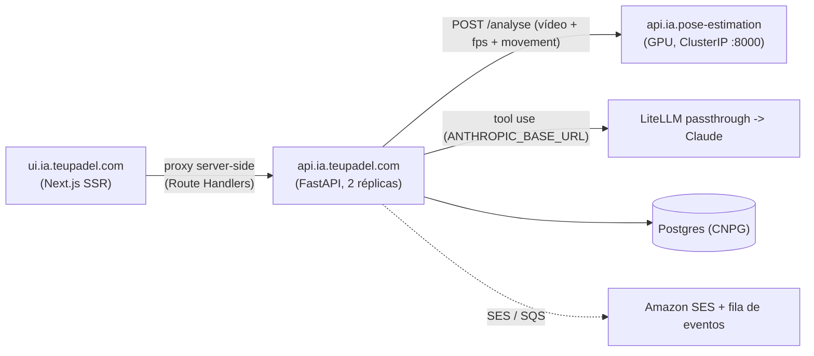

# teupadel.com — API (api.ia.teupadel.com)

!!! warning "Fonte de verdade: código do repo; atualizar aqui em qualquer mudança funcional"
    Esta página descreve `api.ia.teupadel.com` (FastAPI). Se o código e esta página
    divergirem, o código manda. Depois de qualquer mudança funcional na API, atualizar
    esta página **e** a versão EN (`teupadel-api.en.md`) no mesmo trabalho. As regras
    curtas de trabalho (armadilhas, proibições) ficam no `CLAUDE.md` do repo.

A API é o orquestrador do teupadel.com: recebe o vídeo, chama o processor de pose
([teupadel-processor](teupadel-processor.md)), aplica gates de qualidade, pede o
relatório ao Claude (tool use), guarda o resultado em Postgres e trata contas, bolas,
indicações, telemetria e waitlist. Não tem UI. Visão geral do produto, fluxo de dados e
rede em [teupadel.com](teupadel.md).



A API **não tem hostname público**: só a UI lhe fala, pelo Service interno
`teupadel-api.teupadel.svc.cluster.local`, através de Route Handlers proxy
(`src/app/{analyse,telemetry,waitlist,api}` no repo da UI). Isso inclui o redirect do
Google (`redirect_uri = {FRONTEND_URL}/api/auth/callback/google`).

## Contrato de endpoints

Erros de negócio têm `detail` em texto; os códigos estáveis para a UI são `login_required`
e `captcha_failed`.

| Rota | Auth | Resumo |
|---|---|---|
| `GET /health` | não | `{"status": "ok"}` (probes e `HEALTHCHECK`) |
| `POST /analyse` | sessão | Cria a análise (assíncrona) e debita 1 bola. Ver abaixo. |
| `GET /reports`, `GET /reports/{id}`, `DELETE /reports/{id}` | sessão | Histórico de relatórios. Ver "Relatórios assíncronos". |
| `POST /auth/magic-link`, `GET /auth/verify`, `GET /auth/google`, `GET /auth/callback/google`, `POST /auth/logout` | mista | Login unificado. Ver "Autenticação". |
| `GET /me`, `DELETE /me` | sessão | Conta e RGPD. |
| `GET /me/progress` | sessão | Evolução das notas por golpe e geral. Ver "Notas". |
| `POST /telemetry/events` | não | Eventos de produto do browser (via proxy da UI). |
| `POST /waitlist` | não | Interesse na página de Preços. |

### POST /analyse

`multipart/form-data`:

- `file`: vídeo `mp4`/`mov`/`avi`/`mkv`/`webm`, máx. 100 MB (`Content-Length` acima de 100 MB + 2 MB de
  margem é recusado logo; extensão validada com `.lower()`).
- `fps` (query): inteiro 1-10, default 2 (fora do intervalo, o FastAPI responde `422`).
- `lang` (query): `en` | `pt-pt` | `pt-br`, default `pt-pt` (`400` se outro). Só muda o idioma do
  texto gerado pelo Claude; as chaves do JSON não mudam. Tem de acompanhar os locales de
  `ui.ia.teupadel.com/src/i18n/routing.js`.
- `movement` (query, opcional): `serve` | `forehand` | `backhand` | `volley` | `smash` (`400` se
  outro). Repassado ao processor. A UI envia-o quando o utilizador escolhe o golpe (radiogroup do
  `UploadZone`); sem ele o processor faz deteção automática, que é experimental (ver
  [teupadel-processor](teupadel-processor.md)).

**Resposta `202`:** `{"report_id": "<uuid>", "status": "processing", "bolas": <saldo depois do débito>}`.

Erros síncronos: `413` (vídeo grande), `400` (extensão, `lang`, `movement`, `Content-Length`
inválido), `422` (`fps`), `401 login_required` (sem sessão válida), `402` (sem bolas), `429`
(servidor ocupado: pod já tem `MAX_INFLIGHT_ANALYSES` jobs), `500` (base de dados não configurada).
Falhas do processor ou do Claude **não** voltam nesta resposta: o job fecha o relatório como
`failed` com `failure_reason` (ver abaixo).

O resultado do job (guardado em `reports.result` e devolvido em `GET /reports/{id}`) tem dois formatos.

**`analysis_possible: true`:**

```json
{
  "success": true,
  "analysis_possible": true,
  "metadata": { "total_frames": 72, "frames_with_pose": 68, "fps_extracted": 6, "processing_time_s": 13.47 },
  "pose_frames": { "fps_extracted": 6, "frames": [ { "t": 0.166, "points": [ { "n": "nose", "x": 0.512, "y": 0.221 } ] } ] },
  "report": {
    "resumo_geral": "...",
    "pontos_positivos": [ { "titulo": "Direita", "texto": "...", "golpe_index": 1, "tempo_s": 3.2 } ],
    "pontos_a_melhorar": [ { "titulo": "Remate", "texto": "...", "golpe_index": 2, "tempo_s": 8.1 } ],
    "proximo_treino": { "golpe_index": 2, "passos": ["..."], "momentos": { "preparacao_s": 7.5, "impacto_s": 8.1, "terminacao_s": 8.6 } },
    "golpes_detectados": [ { "golpe_index": 1, "nome": "forehand", "movement_source": "user_provided", "movement_warning": null } ]
  }
}
```

**`analysis_possible: false`** (sem `report` nem `pose_frames`; o Claude nem é chamado):

```json
{ "success": true, "analysis_possible": false, "reason": "no_stroke_detected", "metadata": { "total_frames": 72, "frames_with_pose": 12, "fps_extracted": 2, "processing_time_s": 13.47 } }
```

Gates de qualidade (`_analyse_core`, por ordem), todos antes de gastar a chamada ao LLM:

| `reason` | Condição |
|---|---|
| `no_stroke_detected` | `stroke_analysis` do processor vazio |
| `low_pose_detection` | `frames_with_pose / total_frames` abaixo de `MIN_POSE_DETECTION_RATE` (0,30) |
| `low_stroke_confidence` | todos os golpes falharam o gate por golpe (`_filter_quality_strokes`): menos de `MIN_STROKE_FRAMES` (5) frames com pose em `start_s..end_s`, ou `classification_confidence` abaixo de `MIN_STROKE_CONFIDENCE` (0,4) quando o processor a envia. Um golpe que falha é só excluído; só cai neste `reason` quando não sobra nenhum. |

A UI mostra dicas fixas e traduzidas a partir de `reason`, nunca texto do LLM.

Pormenores do relatório:

- `golpe_index` (1-based, pela ordem em que os golpes sobrevivem ao gate) e `tempo_s` ligam cada ponto a
  um momento do vídeo (link "Ver no vídeo" na UI). Os valores do modelo são validados/clamped contra a
  janela real do golpe em `_normalize_report`; valor em falta, de tipo errado ou fora da janela é
  substituído pelo `impact_s` real (nunca `0.0` silencioso). `proximo_treino.momentos` nunca vem do modelo.
- `golpes_detectados` é construído pela API a partir de `stroke_analysis`, nunca pelo LLM; o LLM só
  recebe `movement_warning` como instrução de tom (`prompts.py`).
- O prompt manda `stroke_analysis` (golpes segmentados + desvios DTW), não os `frames` crus. Os
  graus/cm de `deviations` são dado de raciocínio interno; o prompt proíbe citá-los no texto.
- `pose_frames` (só frames com pose) serve para a UI desenhar o esqueleto sobre o vídeo. **Limitação
  conhecida:** `x`/`y` são relativos ao quadrado 640x640 com letterbox do modelo, não ao frame original,
  o que distorce ligeiramente vídeos não quadrados. Corrigir exige o processor devolver `orig_w`/`orig_h`.
- Já não existe `analysis_gif_base64` na resposta da API (o processor ainda o gera, a API ignora-o).
- **Normalização do tool use:** o JSON do Claude não é validado contra schema; `_normalize_report`
  converte tipos com segurança e nunca deixa passar `None`/tipo errado para o frontend. O modelo é o
  configurado em `ANTHROPIC_MODEL`, com `tool_choice` forçado para a tool `gerar_relatorio`,
  `max_tokens=8192`, `thinking` desativado e prompt de sistema em cache.

Erros mapeados dentro do job (aparecem como `failure_reason = http_<código>`): `503` processor
indisponível, `504` timeout do processor (180 s), `502` erro do processor / sem tool use / erro da
Anthropic API, `429` limite da Anthropic, `500` chave da Anthropic em falta ou inválida.

### POST /waitlist

Captura de interesse na página de Preços (via proxy da UI). Body JSON
`{"email", "plan_interest"?, "region"}`: `plan_interest` opcional, um de `5_bolas`/`15_bolas`/
`40_bolas`/`mensal`/`coach`; `region` é `BR` ou `EU` (a UI resolve-a a partir de `CF-IPCountry`, o
utilizador não escolhe). Resposta `202 {"accepted": true}`. Limite: 10 pedidos / 60 s por IP (`429`);
`422` em e-mail/enum inválido; `500` se a base de dados não estiver disponível (não afeta `/analyse`).

### CORS

`allow_origins` vem de `ALLOWED_ORIGINS` (lista separada por vírgulas, default `*` no código; o
`values.yaml` de produção não a define). Métodos `GET`, `POST`, `DELETE`. Como a API não é pública e a
UI faz proxy server-side, o CORS quase não tem efeito em produção.

## Autenticação

Login unificado e sem senha: **não há endpoint de signup** e a senha **não está implementada** (sem
`/auth/login` nem `/auth/reset`). O mesmo pedido de link cria a conta se ela não existir. Lógica em
`auth.py` (tokens, sessões, cliente OAuth do Google) e `email_sender.py` (SES, texto simples).

**Sessão:** cookie `padel_session`, `HttpOnly`, `Secure`, `SameSite=Lax`, `Path=/`, 30 dias. O token
bruto só existe no cookie; na BD (`sessions`) fica o SHA-256. A expiração é fixa (30 dias); cada pedido
autenticado só atualiza `sessions.last_seen_at`, não prolonga a sessão. `SESSION_COOKIE_SECURE=false`
tira a flag `Secure` **só para dev local** (Safari não persiste cookie `Secure` em `http://localhost`);
nunca definir fora de dev. O `SessionMiddleware` do Starlette guarda o `state` do OAuth noutro cookie
assinado (`padel_oauth_state`), que **não** é a sessão de login.

| Rota | O que faz |
|---|---|
| `POST /auth/magic-link` | Body `{email, locale, next?, ref?, turnstile_token?}`. Cria a conta se não existir e envia o link (`{FRONTEND_URL}/{locale}/auth/verify?token=`, válido 15 min). Resposta `202 {"accepted": true}` idêntica exista ou não a conta (anti-enumeração), inclusive para domínio descartável, e-mail suprimido ou limite por conta atingido. `next` é um caminho relativo sem locale (ex. `/account`), validado contra open redirect (`_is_safe_next_path`); `ref` inválido é ignorado em silêncio. Erros: `429` (limite por IP), `400 captcha_failed`, `422` (e-mail/locale/next inválidos). |
| `GET /auth/verify?token=` | Consome o token (uso único), abre sessão (`Set-Cookie`) e devolve `{verified, welcome, next}`. Na primeira confirmação do e-mail concede as 3 bolas de boas-vindas (se a pessoa nunca as teve; ver Anti-abuso) e devolve `welcome: true`, que a UI usa para mostrar o ecrã "Você ganhou 3 bolas". `400` se inválido/expirado/já usado. |
| `GET /auth/google?locale=&next=&ref=` | Redireciona para o consentimento do Google (PKCE + `state` via `authlib`); guarda `locale`/`next`/`ref` na sessão do Starlette. `500` se `GOOGLE_OAUTH_CLIENT_ID`/`SECRET` não estiverem definidos; `400` para `locale`/`next` inválidos. |
| `GET /auth/callback/google` | Troca o code; liga a identidade a uma conta existente com o mesmo e-mail ou cria uma nova (o Google devolve o e-mail verificado; sem `email_verified` dá `400`). Conta nova ou primeira confirmação: redireciona para `{FRONTEND_URL}/{locale}/login?welcome=1`; senão para `next` (se seguro) ou `/{locale}/analysis`. O cookie tem de ser posto no mesmo `RedirectResponse` que se devolve. |
| `POST /auth/logout` | Apaga a sessão da tabela `sessions` e limpa o cookie. |
| `GET /me` | `401` sem sessão. Devolve `id`, `email`, `name`, `locale`, `email_verified`, `created_at`, `providers` (identidades OAuth; o e-mail/magic link está sempre disponível e não entra), `bolas` (saldo em cache) e `referral_code`. |
| `DELETE /me` | RGPD: apaga sessões, identidades e relatórios (`reports`), anonimiza `users` (e-mail vira `deleted-<id>@teupadel.invalid`, nome nulo) e marca `deleted_at`. Grava em `welcome_claims` só o HMAC do e-mail e o saldo com que a pessoa saiu. O vídeo nunca é guardado. |

Antes de qualquer envio consulta-se `email_suppressions` (alimentada pelo worker de eventos do SES).
Login Google não usa Turnstile (o Google já filtra bots). Durante o sandbox do SES, o magic link só
chega a `@teupadel.com` ou a identidades verificadas (ver [teupadel.md](teupadel.md)).

## Bolas e indicação

Cada análise custa 1 bola (`ANALYSIS_COST`). O saldo é `users.bolas` (cache); a fonte de verdade é o
ledger `bola_ledger` (`bolas.py`, migration 0004), com `UNIQUE (user_id, reason, ref)`, o que torna
créditos e estornos idempotentes. Movimentos e valores em [teupadel.md](teupadel.md);
`reason` no ledger: `welcome` (+3), `referral_received`/`referral_given` (+1 cada), `analysis` (-1),
`analysis_refund` (+1), `restored` (devolução de saldo a quem recria a conta).

- `charge` faz um `UPDATE ... WHERE bolas >= custo`, que serializa pedidos concorrentes e impede saldo negativo.
- **Indicação:** link `/login?ref=<código>`; o código (`^[A-Za-z0-9]{6,16}$`) viaja em `email_tokens.referral_code`
  (magic link) ou na sessão do OAuth (Google) e é aplicado quando a conta **nova** confirma o e-mail pela
  primeira vez e recebe boas-vindas. Ignora código inválido, autoindicação, indicador apagado e contas já indicadas.
- **Ajuste manual:** `grant_bolas.py` (dentro do pod da API) concede ou retira bolas por `bolas.grant`, que grava
  o ledger e o saldo na mesma transação (`reason` `manual_adjustment`). Sem `--apply` só simula; `--ref` torna o
  crédito idempotente; `--audit` lista saldos que não batem com o ledger. Nunca inserir em `bola_ledger` à mão
  (aconteceu em 2026-09-30: o saldo em cache ficou desalinhado e a UI não mostrou as bolas).

  ```
  kubectl -n teupadel exec deploy/teupadel-api -- python grant_bolas.py EMAIL 10 --ref campanha-x --apply
  kubectl -n teupadel exec deploy/teupadel-api -- python grant_bolas.py --audit
  ```

## Relatórios assíncronos

`POST /analyse` valida, debita 1 bola, insere o relatório em `reports` (`processing`) e devolve `202`;
o pipeline (processor, gates, Claude) corre num `asyncio.Task` no pod. O vídeo vive só em memória
durante o job (o pod tem limite de 1 Gi; máx. `MAX_INFLIGHT_ANALYSES` jobs por pod, default 3, senão `429`).
O cliente pode fechar a página: o relatório fica no histórico.

`reports.status`: `processing` | `done` | `no_analysis` | `failed`. `no_analysis` e `failed` estornam a bola.

| Endpoint | Notas |
|---|---|
| `GET /reports` | Últimos 50 do utilizador, sem o JSON do relatório: `id`, `status`, `filename`, `movement`, `lang`, `failure_reason`, `created_at`, `finished_at`. |
| `GET /reports/{id}` | Mesmos campos + `result` (o payload acima, ou `null`) + `bolas` (saldo atual). `404` se não existir ou não for do utilizador. |
| `DELETE /reports/{id}` | Apaga um relatório que não esteja `processing`; `404` caso contrário. |

### Notas (beta)

Cada análise concluída traz `result.scores`, calculado por `scoring.py` **só** a partir dos desvios DTW do
processor (o LLM não entra). Desenho e calibração: [roadmap](../products/teupadel-roadmap.md#notas-por-golpe-e-geral).

```json
"scores": {
  "score": 72, "movement": "forehand",
  "phases": { "preparation": 80, "impact": 65, "follow_through": null },
  "metrics": { "impact": { "elbow_angle_right_deg": { "score": 70, "deviation": 11.2 } } },
  "strokes": [ { "movement": "forehand", "score": 72 } ],
  "reference_version": "2026-09-26-yt5", "analysis_version": "1"
}
```

- `scores` é `null` quando os desvios não dão dados suficientes (fase sem 50% das features, ou golpe sem
  50% do peso das fases); a nota nunca é inventada.
- As colunas `reports.score`, `reference_version` e `analysis_version` (migration 0007) espelham o bloco
  para o gráfico não ler o JSON de cada relatório.
- Tolerâncias e pesos são **provisórios** (biblioteca de 5 clips sem calibração). Mudar o cálculo = subir
  `ANALYSIS_VERSION`; trocar a biblioteca = `REFERENCE_VERSION` (env, padrão `2026-09-26-yt5`).
- `GET /me/progress` (`401` sem sessão) devolve `{movements: {golpe: [ponto]}, overall: [ponto],
  version_breaks: [data]}`, com até 500 relatórios `done` com nota; `ponto` = `{id, date, score,
  reference_version, analysis_version}`. `overall` = média da última nota de cada golpe nos últimos 30 dias.
  `version_breaks` marca a troca de versão: a UI mostra "refinámos o modelo" e não liga os pontos.

`failure_reason`: `no_stroke_detected`, `low_pose_detection`, `low_stroke_confidence`, `internal_error`,
`http_<código>`, `timeout`.

**Jobs mortos** (pod reiniciado a meio): qualquer `GET /reports*` fecha como `failed`/`timeout` os
`processing` do utilizador com mais de 10 min (`_STALE_JOB_MINUTES`) e estorna. O fecho
(`UPDATE ... WHERE status = 'processing'`) e o estorno correm na mesma transação, por isso job e
varrimento nunca estornam duas vezes. Retenção: por omissão os relatórios ficam até o utilizador
apagar o relatório ou a conta (`REPORT_RETENTION_DAYS`, ver Anti-abuso).


## Análises com upload direto e fila durável

Fluxo novo (Fase 1 do [roadmap](../products/teupadel-roadmap.md)), ativo só com `ANALYSIS_UPLOADS_BUCKET`;
sem ele os endpoints respondem `503 uploads_unavailable` e o `POST /analyse` antigo continua a funcionar.
`analysis_id` é o próprio `reports.id`, então `/reports/{id}` mostra a mesma análise.

1. `POST /analyses` com `{filename, size_bytes, content_type?, movement?, lang?, fps?}`: valida (extensão,
   máx. 100 MB, idioma, golpe), exige sessão, debita 1 bola, abre um **multipart** no S3 e devolve `201`
   com `{analysis_id, status: "uploading", upload: {part_size, parts, uploaded_parts}, bolas}`. Máx. 3
   uploads abertos por usuário (`429`); sem saldo, `402`.
2. `POST /analyses/{id}/parts` com `{part_numbers: [1, 2]}` devolve URLs pré-assinadas (`PUT`, válidas 1 h)
   para o browser enviar cada parte (8 MiB; a última pode ser menor).
3. `POST /analyses/{id}/complete` confere no S3 que todas as partes chegaram com o tamanho certo, fecha o
   multipart e põe a análise em `queued`. Faltam partes: `409 {code: parts_missing, missing_parts}`.
   Idempotente.
4. `GET /analyses/{id}`: `status` = `uploading` | `queued` | `processing` | `completed` | `rejected` | `failed`.
   Em `uploading` traz `upload.uploaded_parts` (para **retomar** o envio de onde parou). `completed` traz
   `movement`, `score`, `phases`, `metrics`, `positives`, `improvements`, `summary`, `reference_version`,
   `analysis_version`; `rejected` e `failed` trazem `reason` e `bola_refunded` (a bola é sempre estornada).

Mapa com o banco: `done` é `completed` e `no_analysis` é `rejected`; `uploading` e `queued` aparecem como
`processing` em `/reports*` (a UI antiga só conhece esse).

**Worker** (`_queue_worker`, em todas as réplicas, só com o bucket configurado): reclama o job mais antigo com
`SELECT ... FOR UPDATE SKIP LOCKED`, baixa o vídeo, corre o mesmo pipeline do `POST /analyse` e **apaga o
vídeo do S3 no fim, com sucesso ou falha**. Bate `heartbeat_at` a cada 30 s. A cada 30 s um varrimento:
`processing` sem heartbeat há mais de 2 min volta à fila (máx. 2 tentativas, depois `failed` + estorno);
`uploading` com mais de 30 min falha (`upload_timeout`), estorna e aborta o multipart. Erro transitório
(processor em baixo, exceção) com tentativas sobrando volta à fila e o vídeo fica para a 2.ª tentativa.

**Privacidade:** o bucket não tem versionamento e a regra de ciclo de vida (IaC `s3-analysis-uploads`, 1 dia)
apaga o que sobrar. Nunca guardar vídeo para depurar. **Pendências de infra** (ver backlog): CORS do bucket
para o `PUT` vir do browser e a região UE: ambos no PR do IaC (`iac.homelab-live-infra`#36, bucket `...-uploads-eu` em `eu-west-1`), que só vale depois do apply.

## Anti-abuso

- **Boas-vindas uma vez por pessoa, mesmo após apagar a conta.** `DELETE /me` anonimiza `users`, então
  `welcome_claims` (migration 0006) guarda só `HMAC-SHA256` do e-mail normalizado (minúsculas, sem `+tag`,
  sem pontos no Gmail; chave `EMAIL_HASH_KEY`, com fallback para `SESSION_SECRET_KEY`) e o saldo com que a
  pessoa saiu. `bolas.claim_welcome` concede +3 só na primeira vez; quem volta recupera o saldo (`restored`),
  sem novas bolas nem recompensa de indicação. Não trava quem usa e-mails realmente diferentes: esse é o papel
  do Turnstile e dos limites abaixo.
- **Cloudflare Turnstile** em `POST /auth/magic-link` (campo `turnstile_token`): só ativo com
  `TURNSTILE_SECRET_KEY` (SSM `/teupadel/turnstile/secret-key`; widget criado por IaC). Sem token válido
  responde `400 captcha_failed` (não revela se a conta existe). Erro de rede para o Cloudflare deixa passar
  (fail-open); `success: false` bloqueia.
- **Limite por IP:** 5 pedidos/hora em `/auth/magic-link` (store em memória por pod, `_auth_hits`); 60
  eventos/60 s em `/telemetry/events`; 10 pedidos/60 s em `/waitlist`. O IP vem de `CF-Connecting-IP`
  (fallback: ligação TCP). Os stores em memória crescem uma chave por IP e não são partilhados entre réplicas.
- **Limite por conta:** `EMAIL_LINKS_PER_HOUR` (default 5) links por e-mail/hora, além do limite por IP;
  excedido, responde `202` sem enviar.
- **Domínios descartáveis** (`disposable_emails.py`, lista curta embutida, extensível por
  `DISPOSABLE_EMAIL_DOMAINS`): `202` sem criar conta nem enviar.
- **Supressão de e-mail:** `ses_events.py` corre como task de fundo (lifespan) e faz long polling na fila SQS
  `teupadel-ses-events` (SES -> SNS -> SQS). Só ativo com `SES_EVENTS_QUEUE_URL`. Bounce **Permanent** e
  reclamação vão para `email_suppressions` (`ON CONFLICT DO NOTHING`); bounces transitórios e `Delivery` são
  ignorados. Mensagem ilegível é apagada; erro de BD deixa a mensagem na fila (reentrega). Precisa de
  `sqs:ReceiveMessage`/`DeleteMessage` nas credenciais AWS da API (IaC `iac-mail-routing`, módulo
  `aws-ses-smtp-user`). Com 2 réplicas ambas consomem a mesma fila; o SQS entrega cada mensagem a uma só.
- **RGPD:** `users.terms_version`/`terms_accepted_at` gravados ao criar a conta (`TERMS_VERSION`, default
  `2026-09-draft`; os textos ainda são rascunho).
- **Limpeza** (`maintenance.py`, de hora a hora, todas as réplicas, idempotente): sessões expiradas há mais de
  1 dia, tokens de e-mail expirados há mais de 7 dias e, se `REPORT_RETENTION_DAYS` > 0, relatórios concluídos
  mais antigos que N dias (0 = guardar até o utilizador apagar).
- **Upload:** 100 MB máx., leitura em chunks de 1 MB (`_read_upload_limited`).

## Telemetria

Três sinais, todos via Alloy -> Grafana Cloud (ver `telemetry.py`): traces (FastAPI e httpx
auto-instrumentados) e métricas por OTLP/HTTP; eventos de negócio como uma linha JSON no stdout
(`log_type=business_event`, com `trace_id` do span ativo), que o Alloy envia para o Loki; e os logs da app
em JSON por linha (`_JsonLogFormatter`, com `trace_id`/`span_id`) para o "Logs for this trace" do Tempo.
Tudo é no-op se `OTEL_EXPORTER_OTLP_ENDPOINT` estiver ausente ou `OTEL_SDK_DISABLED=true`. O frontend
propaga `session.id`/`visitor.id` (e `client.channel`) no header W3C `baggage`, copiados para atributos de
todos os spans pelo `_BaggageSpanProcessor`. Visão do produto em [teupadel.md](teupadel.md).

**`POST /telemetry/events`** (browser, via proxy da UI): body
`{"event_type", "session_id" (8-64 chars), "visitor_id"?, "payload"?}`. `event_type` aceita só
`CLIENT_EVENT_TYPES`: `pageview`, `upload_started`, `client_error`, `payment_step`, `payment_completed`
(outro valor: `422`). Payload acima de 4 KB: `413`; 60 eventos/60 s por IP: `429`. Resposta
`202 {"accepted": true}`. Enriquece com país (`CF-IPCountry`), `Referer` e `User-Agent` truncados; **o IP
em bruto nunca é guardado**. Linhas de evento acima de 8 KB têm o payload truncado.

**Eventos emitidos pelo servidor** (nunca aceites do browser):

| Evento | Quando / payload |
|---|---|
| `analysis_completed` | fim do pipeline: `duration_ms`, `total_frames`, `frames_with_pose`, `processing_time_s`, `strokes_detected`, `strokes_kept`, `analysis_possible`, `reason`, `lang`, `fps`, `movement` |
| `analysis_failed` | falha no pipeline: `status_code`, `detail`, `duration_ms`, `lang`, `fps`, `movement` |
| `analysis_refunded` | bola devolvida: `{status: no_analysis\|failed, reason}`; uma só vez por análise; sem e-mail nem user_id |
| `login_requested` | `{method: email\|google}` |
| `login_succeeded` | `{method}` |
| `login_failed` | `{method, reason}`: `captcha_failed`, `email_rate_limited`, `oauth_exchange`, `unverified_identity` |
| `email_verified` | primeira confirmação do e-mail: `{method}` |
| `referral_rewarded` | conta indicada confirmou o e-mail e ambos ganharam +1: `{method}` |

Os eventos `analysis_*` usam o `session.id` lido do header `baggage` no `POST /analyse` e o `trace_id` do
job (`analyse.job`).

## Variáveis de ambiente

Valores de produção em `gitops.teupadel.com/helm/api/values.yaml` (configMap = env; ExternalSecret = SSM).

| Variável | Default (código) | Descrição |
|---|---|---|
| `ANTHROPIC_API_KEY` | (obrigatória) | Em produção é a virtual key do LiteLLM (SSM `/homelab/teupadel/litellm-key`). Sem ela o job falha com `500`. |
| `ANTHROPIC_BASE_URL` | vazio | Passthrough Anthropic do LiteLLM (`http://litellm.litellm.svc.cluster.local:4000/anthropic`). Vazio = direto à Anthropic. |
| `ANTHROPIC_MODEL` | ver `main.py` | Modelo do relatório; o `values.yaml` também o define. |
| `PROCESSOR_URL` | `http://teupadel-processor.teupadel.svc.cluster.local:8000` | Processor de pose. |
| `DATABASE_URL` / `PGHOST`, `PGPORT`, `PGUSER`, `PGPASSWORD`, `PGDATABASE` | (nenhuma) | DSN completa ou variáveis libpq (o que produção usa; vêm do secret `teupadel-app` do CNPG, base `teupadeldb`). Sem nenhuma, os endpoints com BD dão `500` (inclui `/analyse`, que exige sessão e bolas); `/health` e `/telemetry/events` continuam a funcionar. |
| `ALLOWED_ORIGINS` | `*` | Origins do CORS, separados por vírgula. |
| `FRONTEND_URL` | `http://localhost:3000` | UI pública; monta links de e-mail e o `redirect_uri` do Google. Produção: `https://teupadel.com`. |
| `GOOGLE_OAUTH_CLIENT_ID` / `GOOGLE_OAUTH_CLIENT_SECRET` | (nenhuma) | Cliente OAuth do Google (SSM `/teupadel/google/oauth/*`). Sem eles `/auth/google` dá `500`. |
| `SESSION_SECRET_KEY` | aleatória por processo | Assina o cookie de state do OAuth. **Tem de ser igual em todas as réplicas** (SSM `/teupadel/api/session-secret-key`); sem ela o login Google falha de forma intermitente e o código avisa no arranque. |
| `SESSION_COOKIE_SECURE` | `true` | `false` só em dev local. |
| `EMAIL_HASH_KEY` | `SESSION_SECRET_KEY` | Chave do HMAC de `welcome_claims`. Não definida em produção (usa o fallback). Trocá-la invalida os hashes existentes. |
| `EMAIL_LINKS_PER_HOUR` | `5` | Links por e-mail/hora. |
| `TURNSTILE_SECRET_KEY` | (desligado) | Ativa o Turnstile (SSM `/teupadel/turnstile/secret-key`). |
| `TERMS_VERSION` | `2026-09-draft` | Versão dos Termos gravada ao criar a conta. |
| `DISPOSABLE_EMAIL_DOMAINS` | vazio | Domínios extra bloqueados, separados por vírgula. |
| `MAX_INFLIGHT_ANALYSES` | `3` | Jobs simultâneos por pod. |
| `ANALYSIS_UPLOADS_BUCKET` / `ANALYSIS_UPLOADS_PREFIX` / `ANALYSIS_UPLOADS_REGION` | (desligado) / `uploads/` / `eu-west-1` | Bucket S3 dos vídeos temporários (UE: `cmoreira-dev-teupadel-analysis-uploads-eu`). Sem o bucket, `/analyses*` dá `503` e o worker da fila não arranca. |
| `REPORT_RETENTION_DAYS` | `0` | `>0` apaga relatórios concluídos mais antigos; `0` = guardar. |
| `SES_REGION` / `SES_SENDER` / `SES_CONFIGURATION_SET` | `us-east-1` / `TeuPadel <noreply@teupadel.com>` / `teupadel-transactional` | Amazon SES. |
| `AWS_ACCESS_KEY_ID` / `AWS_SECRET_ACCESS_KEY` | (nenhuma) | IAM user da API (SSM `/teupadel/ses/api`). Sem credenciais (`AWS_ROLE_ARN`/`AWS_PROFILE` também servem), `email_sender.py` fica no-op: regista e não envia, sem falhar o pedido. |
| `SES_EVENTS_QUEUE_URL` | (desligado) | Fila SQS dos eventos do SES; liga o worker. |
| `OTEL_EXPORTER_OTLP_ENDPOINT` (+ `_PROTOCOL`), `OTEL_SERVICE_NAME`, `OTEL_RESOURCE_ATTRIBUTES`, `OTEL_TRACES_SAMPLER`, `OTEL_SDK_DISABLED` | (desligado) | Telemetria; produção usa `http://alloy-worker.alloy.svc.cluster.local:4318`, serviço `teupadel-api`. |

A porta do container é `8080` (fixa no `CMD` do `Dockerfile`, não é variável).

## Estrutura do repo

```
api.ia.teupadel.com/
├── main.py               FastAPI: endpoints, pipeline do job, gates de qualidade, normalização do relatório
├── prompts.py            system prompt (por idioma) + build_user_message
├── auth.py               tokens de e-mail, sessões, cliente OAuth do Google
├── bolas.py              ledger de bolas, indicação, boas-vindas anti-abuso
├── email_sender.py       e-mail transacional via Amazon SES (no-op sem credenciais)
├── ses_events.py         worker SQS de bounces/reclamações -> email_suppressions
├── maintenance.py        limpeza horária (sessões, tokens, relatórios antigos)
├── disposable_emails.py  domínios descartáveis
├── analyses.py           contrato de /analyses: mapa de estados e vista pública
├── uploads.py            S3: multipart pré-assinado, download e apagamento do vídeo
├── scoring.py            notas determinísticas (0-100) e séries do gráfico de evolução
├── telemetry.py          OTel, baggage, eventos de negócio, formatter JSON
├── db.py                 pool asyncpg (lazy; DATABASE_URL ou PG*)
├── migrate.py            `python -m migrate` (init container, advisory lock)
├── migrations/           0001_waitlist_signups, 0002_auth, 0003_login_ux,
│                         0004_bolas_ledger_referral, 0005_reports, 0006_welcome_claims_terms,
│                         0007_report_scores, 0008_analysis_queue
├── tests/                pytest (abuso, auth, normalização, SES, telemetria, Turnstile, integração com BD)
├── openapi.yaml · requirements.txt · requirements-dev.txt · Dockerfile
└── .github/workflows/    build-push.yml (ECR), test.yml (pytest com Postgres 17, em PR)
```

Tabelas: `users`, `user_identities`, `sessions`, `email_tokens` (só hashes de token), `email_suppressions`,
`waitlist_signups`, `bola_ledger`, `reports` (JSON do relatório, sem vídeo), `welcome_claims`,
`schema_migrations`. Nenhum IP, senha ou vídeo é persistido. Não há ORM nem Alembic.

## Migrations

Ficheiros SQL numerados em `migrations/`, aplicados por `python -m migrate` num **init container**
(`migrate`) do Deployment, antes de qualquer réplica receber tráfego. Um `pg_advisory_lock` serializa
execuções concorrentes, cada migration corre na sua transação e o registo fica em `schema_migrations`;
falha = `Init:Error` e o rollout pára (os pods antigos continuam a servir). A app nunca corre DDL. Devem
ser **aditivas** (expand/contract), porque versões antiga e nova convivem durante o rollout.

## Deploy

- **Build:** push para `main` (ou tag `v*`) dispara `build-push.yml`, workflow reutilizável do org, que
  publica no ECR `teupadel/api` via OIDC (ver [Build & Registry](../cicd/build-registry.md)). Imagem
  `python:3.14-slim`, utilizador não-root UID 10001, porta `8080`, `HEALTHCHECK` em `/health`. O `Dockerfile`
  copia os módulos por nome: um `.py` novo exige atualizar o `COPY`.
- **GitOps:** `gitops.teupadel.com/helm/api` (wrapper do chart `generic-app`), Application `teupadel-api` do
  Argo CD com auto-sync (`prune` + `selfHeal`), namespace `teupadel`. O argocd-image-updater escolhe a tag mais
  recente (`^[0-9a-f]{7}$`) do ECR e grava-a no `values.yaml`.
- **Runtime:** 2 réplicas; requests 100m/256Mi, limits 1 CPU/1Gi (o vídeo fica em RAM ~110 s por análise;
  com 256Mi um upload de ~70 MB dava OOMKill). Init container `migrate` com as credenciais `PG*` do secret
  `teupadel-app`. Probes de liveness e readiness em `/health`. `securityContext` restricted (UID 10001, sem
  privilégios, `drop ALL`).
- **Segredos:** `ExternalSecret` `teupadel-api-secret` a partir do SSM (`ClusterSecretStore aws-ssm`), ver
  [Secrets & Segurança](../architecture/secrets.md). `ANTHROPIC_API_KEY` é a virtual key do LiteLLM.
- **Rede:** sem `httpRoute`. `NetworkPolicy` `teupadel-api` só admite a UI (porta 8080) e `teupadel-postgres`
  só admite a API, o operador CNPG, as réplicas e o Alloy. Ver [Rede & Ingress](../architecture/networking.md).

!!! warning "NetworkPolicy sem efeito hoje"
    O `values.yaml`/templates do GitOps anotam que o CNI atual (flannel) **não aplica** NetworkPolicy; só teria
    efeito com um CNI que a imponha (Cilium/Calico). Tratar o isolamento como não garantido.

## Testes

```bash
pip install -r requirements-dev.txt   # só dev; nunca instalado na imagem
pytest
```

`tests/test_integration_db.py` precisa de Postgres (`PGHOST`, `PGUSER`, `PGPASSWORD`, `PGDATABASE`).
`.github/workflows/test.yml` corre `pytest` em PRs com um Postgres 17 e `SESSION_COOKIE_SECURE=false`
(Python 3.14). O build da imagem só corre no push para `main`, portanto validar o `docker build` localmente.
Execução local da API:

```bash
pip install -r requirements.txt
ANTHROPIC_API_KEY=... SESSION_COOKIE_SECURE=false uvicorn main:app --reload --port 8080
```

## Pendências e itens a confirmar

- Fila durável em S3 (vídeo persistido durante o job): planeada, **não implementada**. Hoje o vídeo só existe
  em memória e um pod reiniciado perde o job (o varrimento fecha-o como `failed`/`timeout` e estorna).
- Sem retenção automática por omissão (`REPORT_RETENTION_DAYS=0`) e Termos/Política ainda em rascunho.
- Overlay do esqueleto não é pixel-perfect em vídeos não quadrados (depende do processor devolver `orig_w`/`orig_h`).
- Falta banner de consentimento de cookies (ver [teupadel.md](teupadel.md)).

!!! note "confirmar"
    - Que a UI reencaminha `CF-Connecting-IP`/`CF-IPCountry` nos proxies (`src/app/*/route.js`): a API só lê os
      headers; sem eles o rate limit por IP cai para o IP da ligação TCP (o IP do pod da UI).
    - Estado atual do sandbox do SES (o texto de [teupadel.md](teupadel.md) diz que o
      magic link só chega a `@teupadel.com` e identidades verificadas).
    - Permissões `sqs:ReceiveMessage`/`DeleteMessage` das credenciais AWS da API em produção (definidas fora
      deste repo, no IaC).
