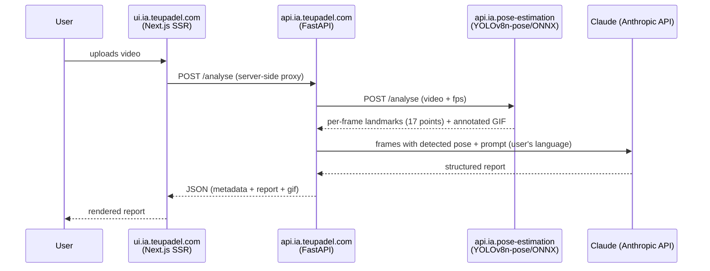

# teupadel.com

AI-assisted padel movement analysis: the user uploads a video of a play, the
application extracts the player's pose frame by frame, and returns an
LLM-generated feedback report — strengths, points to improve, and
suggestions per movement.

## Components

| Repo | Role | Stack |
|---|---|---|
| `ui.ia.teupadel.com` | Public frontend, marketing pages + the tool itself | Next.js 15 (App Router, SSR), `next-intl` (en/pt-pt/pt-br) |
| `api.ia.teupadel.com` | Orchestration: receives the video, calls the pose processor, calls the LLM, assembles the report | FastAPI |
| `api.ia.pose-estimation` | Per-frame pose extraction | ONNX Runtime + YOLOv8n-pose model |
| `gitops.teupadel.com` | Deploys the two web components (api + ui) | Helm (generic chart) + ArgoCD |

## Data flow

The UI never talks directly to the pose processor or to the Anthropic API —
everything goes through `api.ia.teupadel.com`, the only component with
access to the Anthropic API key.

## Landmarks extracted

The pose processor returns 17 points per frame (`nose`, shoulders, elbows,
wrists, hips, knees, ankles, eyes, ears), each with normalized position
(x, y) and confidence (`visibility`). Only frames with a detected pose are
sent to the LLM, to keep the payload small.

## Internationalization

The UI serves three locales with a URL prefix (`/en`, `/pt-pt`, `/pt-br`),
each with a marketing page and a tool page (`/analysis`). The `lang`
parameter is passed all the way to `api.ia.teupadel.com`, which uses it to
generate the report in the right language — the response JSON's keys don't
change, only the textual content inside them.

## Networking

Its own domain (`teupadel.com`), served by the dedicated
`nginx-gateway-teupadel-com` Gateway. Only the frontend is exposed:

| Hostname | Component |
|---|---|
| `www.teupadel.com` | `ui.ia.teupadel.com` |

`api.ia.teupadel.com` **has no public hostname**. The browser only calls
`/analyse` on the Next.js server itself, and the Route Handler
(`src/app/analyse/route.js`) proxies server-side to the in-cluster Service
`http://teupadel-api.teupadel.svc.cluster.local` — pod→pod traffic that never
leaves the cluster. There is no `api.teupadel.com` entry in cloudflared.

See [Networking & Ingress](../architecture/networking.md) for the dedicated
hostname pattern (no path rewriting).

## Secrets

`api.ia.teupadel.com` consumes the Anthropic API key via `ExternalSecret`,
from SSM Parameter Store — see
[Secrets & Security](../architecture/secrets.md).

## Telemetry & Observability

Two channels, both inside the existing Grafana stack (Alloy → Grafana Cloud) —
no new backend, no Postgres.

| Signal | Path | Destination |
|---|---|---|
| Traces (UI → api → processor → Anthropic) | OTLP/HTTP → `alloy-worker.alloy.svc:4318` | Tempo |
| Metrics (endpoint latency, `http.server.duration` histogram) | OTLP/HTTP → Alloy | Mimir |
| Business events (`pageview`, `upload_started`, `analysis_completed`, ...) | JSON line on pod stdout (`log_type=business_event`) → Alloy scrape | Loki |

**Session ↔ error correlation.** The frontend generates a `session_id` (cookie,
30-min sliding window) and a `visitor_id` (cookie, 1 year), and propagates them
in the W3C `baggage` header on every API call. `api.ia.teupadel.com` copies
`session.id` / `visitor.id` onto **every** span's attributes — in Grafana you
filter `session.id="..."` in Tempo to see every trace from that visit. Each
request is still its own trace (no "trace-as-session").

Browser events don't hit the API directly (it isn't public): `navigator.sendBeacon`
targets `/telemetry` on the UI itself, and the Route Handler
`src/app/telemetry/route.js` proxies to `POST /telemetry/events` on the API,
which validates (closed `event_type` enum, per-IP rate limit, payload cap),
enriches with country/origin from the Cloudflare Tunnel headers (without storing
the raw IP), and emits the JSON line.

Configured via `OTEL_*` env vars in `gitops.teupadel.com/helm/api/values.yaml`.
All instrumentation is a no-op if `OTEL_EXPORTER_OTLP_ENDPOINT` is removed.

!!! note "Open items"
    - `api.ia.pose-estimation` is instrumented but **dormant** while it runs on
      the LXC (192.168.1.20) with no route to the in-cluster Alloy — needs a
      NodePort/LB or a local collector. The `traceparent` is already propagated,
      so it links up once enabled.
    - A cookie-consent banner / privacy-policy note is still missing (pageviews +
      persistent cookie + country, EU users).

## Namespace and registry

Both web components run in the `teupadel` namespace, with images published
to ECR (`<account>.dkr.ecr.us-east-1.amazonaws.com/teupadel/api` and
`.../teupadel/ui`) by the pipeline described in
[Build & Registry](../cicd/build-registry.md).
