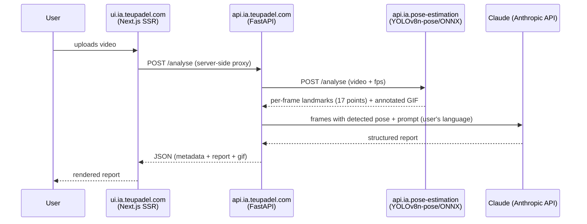

# teupadel.com

AI-assisted padel movement analysis: the user uploads a video of a play, the
application extracts the player's pose frame by frame, and returns an
LLM-generated feedback report — strengths, points to improve, and
suggestions per movement.

## Components

| Repo | Role | Stack |
|---|---|---|
| `ui.ia.teupadel.com` | Public frontend, marketing pages + the tool itself | Next.js 15 (App Router, SSR), `next-intl` (en/pt-pt/pt-br) |
| `api.ia.teupadel.com` | Orchestration: receives the video, calls the pose processor, calls the LLM, assembles the report | FastAPI |
| `api.ia.pose-estimation` | Per-frame pose extraction | ONNX Runtime + YOLOv8n-pose model |
| `gitops.teupadel.com` | Deploys the two web components (api + ui) | Helm (generic chart) + ArgoCD |

## Data flow

The UI never talks directly to the pose processor or to the Anthropic API —
everything goes through `api.ia.teupadel.com`, the only component with
access to the Anthropic API key.

## Landmarks extracted

The pose processor returns 17 points per frame (`nose`, shoulders, elbows,
wrists, hips, knees, ankles, eyes, ears), each with normalized position
(x, y) and confidence (`visibility`). Only frames with a detected pose are
sent to the LLM, to keep the payload small.

## Internationalization

The UI serves three locales with a URL prefix (`/en`, `/pt-pt`, `/pt-br`),
each with a marketing page and a tool page (`/analysis`). The `lang`
parameter is passed all the way to `api.ia.teupadel.com`, which uses it to
generate the report in the right language — the response JSON's keys don't
change, only the textual content inside them.

## Networking

Its own domain (`teupadel.com`), served by the dedicated
`nginx-gateway-teupadel-com` Gateway:

| Hostname | Component |
|---|---|
| `www.teupadel.com` | `ui.ia.teupadel.com` |
| `api.teupadel.com` | `api.ia.teupadel.com` |

See [Networking & Ingress](../architecture/networking.md) for the dedicated
hostname pattern (no path rewriting).

## Secrets

`api.ia.teupadel.com` consumes the Anthropic API key via `ExternalSecret`,
from SSM Parameter Store — see
[Secrets & Security](../architecture/secrets.md).

## Namespace and registry

Both web components run in the `teupadel` namespace, with images published
to ECR (`<account>.dkr.ecr.us-east-1.amazonaws.com/teupadel/api` and
`.../teupadel/ui`) by the pipeline described in
[Build & Registry](../cicd/build-registry.md).
