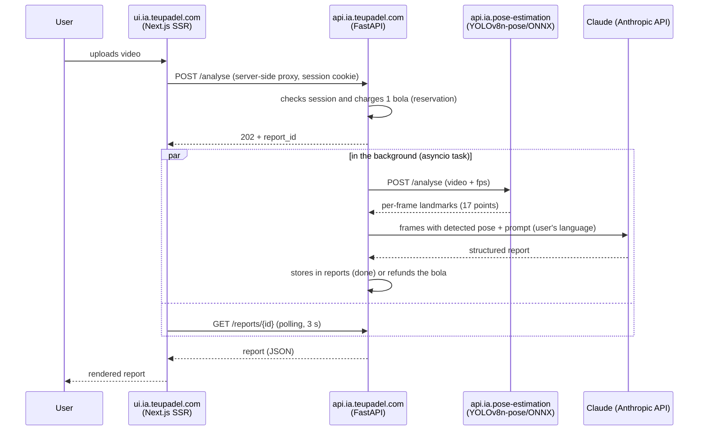
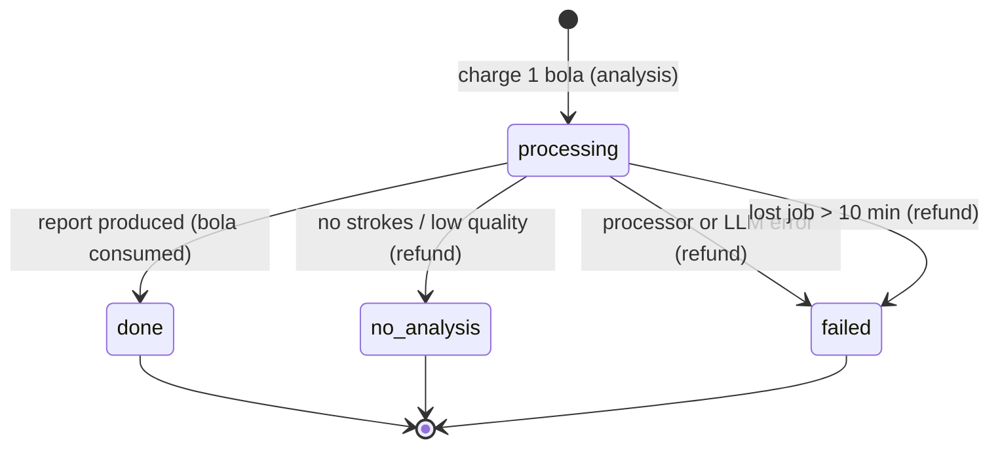

# teupadel.com

AI-assisted padel movement analysis: the user uploads a video of a play, the
application extracts the player's pose frame by frame, and returns an
LLM-generated feedback report — strengths, points to improve, and
suggestions per movement.

## Components

| Repo | Role | Stack |
|---|---|---|
| `ui.ia.teupadel.com` | Public frontend, marketing pages + the tool itself | Next.js 15 (App Router, SSR), `next-intl` (en/pt-pt/pt-br) |
| `api.ia.teupadel.com` | Orchestration: receives the video, calls the pose processor, calls the LLM, assembles the report | FastAPI |
| `api.ia.pose-estimation` | Per-frame pose extraction | ONNX Runtime **GPU** (YOLOv8n-pose) — K8s on `proxmox-k8s-gpu-worker-1` (RTX 3060, time-slicing). Migrated off the LXC `192.168.1.20` in 2026-08. |
| `gitops.teupadel.com` | Deploys the three components (api + ui + processor) | Helm (`generic-app`) + ArgoCD |

## Data flow

```mermaid
sequenceDiagram
    participant U as User
    participant UI as ui.ia.teupadel.com<br/>(Next.js SSR)
    participant API as api.ia.teupadel.com<br/>(FastAPI)
    participant Pose as api.ia.pose-estimation<br/>(YOLOv8n-pose/ONNX)
    participant LLM as Claude (Anthropic API)

    U->>UI: uploads video
    UI->>API: POST /analyse (server-side proxy, session cookie)
    API->>API: checks session and charges 1 bola (reservation)
    API-->>UI: 202 + report_id
    par in the background (asyncio task)
        API->>Pose: POST /analyse (video + fps)
        Pose-->>API: per-frame landmarks (17 points)
        API->>LLM: frames with detected pose + prompt (user's language)
        LLM-->>API: structured report
        API->>API: stores in reports (done) or refunds the bola
    and
        UI->>API: GET /reports/{id} (polling, 3 s)
    end
    API-->>UI: report (JSON)
    UI-->>U: rendered report
```

The UI never talks directly to the pose processor or to the Anthropic API —
everything goes through `api.ia.teupadel.com`, the only component with
access to the Anthropic API key.

Each report point (`pontos_positivos`/`pontos_a_melhorar`) carries a
`golpe_index` (1-based, the stroke's order in the video) and a `tempo_s` — the
UI uses this for a "watch in video" link that seeks the user's own uploaded
video (kept locally in the browser, never sent back by the API). The
angle/degree numbers in `deviations` are still sent to Claude as internal
reasoning input, but never surface as text in the response. When
`stroke_analysis` comes back empty, or pose was detected in too few frames
(`frames_with_pose / total_frames` under 30%), the API returns
`analysis_possible: false` + `reason` (`no_stroke_detected` or
`low_pose_detection`) without calling the Anthropic API at all — the UI shows
fixed tips instead of an empty report.

## Accounts, bolas and referrals

Login is unified (magic link + Google): the same request creates the account if
it doesn't exist yet. Google returns an already-verified e-mail, so no e-mail is
sent — only the magic link goes through SES.

Each analysis costs **1 bola**. The balance is `users.bolas` (a cache); the source
of truth is the `bola_ledger` table: every movement is a **unique** `(user, reason,
ref)` entry, which makes credits and refunds idempotent.

| Movement | When | Amount |
|---|---|---|
| `welcome` | first e-mail confirmation (magic link or Google) | +3 |
| `referral_received` / `referral_given` | the referred account confirms its e-mail | +1 each |
| `analysis` | an analysis starts | −1 |
| `analysis_refund` | analysis produced no report | +1 |

**Referral:** the link is `/login?ref=<code>` (`referral_code` comes from `/me`).
The code travels with the magic-link request (`email_tokens.referral_code`) or the
Google OAuth `state` and is applied when the new account confirms its e-mail. No
self-referral, and an account can only be referred once.

Upload and the tool page stay open to anonymous visitors. On **Analyse**, users
without a session are sent to login (`401 login_required`) and users without
balance to `/pricing` (`402`).

## Async analysis and report history

`POST /analyse` doesn't block until the report is ready. The API reserves the
bola, inserts a `reports` row and answers `202` with a `report_id`; the pipeline
(pose processor → quality gate → LLM) runs in the background inside the pod. The
UI polls `GET /reports/{id}`. If the user closes the page the report is still
produced and shows up under **Account → My reports** (`/reports/[id]`). The
**video is never stored** — only the report JSON — so a saved report has no player
and no "Watch in video" links.

The flow is a **lightweight saga with compensation**, orchestrated inside the API
itself (no broker): reserve the bola → process → confirm (stays charged) or
compensate (refund).

```mermaid
stateDiagram-v2
    [*] --> processing: charge 1 bola (analysis)
    processing --> done: report produced (bola consumed)
    processing --> no_analysis: no strokes / low quality (refund)
    processing --> failed: processor or LLM error (refund)
    processing --> failed: lost job > 10 min (refund)
    done --> [*]
    no_analysis --> [*]
    failed --> [*]
```

- Closing the report (`UPDATE … WHERE status = 'processing'`) and the refund run in
  the same transaction; the refund key is `(user, analysis_refund, report_id)`, so
  the job and the sweeper can never refund twice.
- **Lost jobs** (pod restarted mid-run): any `GET /reports*` closes reports stuck in
  `processing` for over 10 minutes as `failed`/`timeout` and refunds.
- At most `MAX_INFLIGHT_ANALYSES` (3) jobs per pod to protect memory (the video sits
  in RAM during the job); beyond that `429`.
- `DELETE /reports/{id}` removes one report; `DELETE /me` removes all of them. No
  automatic retention yet.

| Endpoint | Purpose |
|---|---|
| `POST /analyse` | `202 {report_id}`; `401 login_required`, `402`, `429` |
| `GET /reports` | the user's last 50 reports |
| `GET /reports/{id}` | status + result |
| `DELETE /reports/{id}` | delete a finished report |

## Stored data

`users` (e-mail, name, language, balance, `referral_code`, `referred_by`),
`user_identities`, `sessions` and `email_tokens` (token hashes only), `bola_ledger`,
`reports` (report JSON, no video), `email_suppressions` and `waitlist_signups`. No
IP, password or video is persisted.

## Landmarks extracted

The pose processor returns 17 points per frame (`nose`, shoulders, elbows,
wrists, hips, knees, ankles, eyes, ears), each with normalized position
(x, y) and confidence (`visibility`). Only frames with a detected pose are
sent to the LLM, to keep the payload small.

Each frame with a detected pose also carries a `features` field — elbow and
knee angles, shoulder-hip rotation separation, wrist height relative to the
shoulder, and hip velocity/acceleration (computed between consecutive
detected frames via `timestamp_s`, not frame index). This is the
deterministic basis for DTW comparison against the reference library — see
`api.ia.pose-estimation/features.py`. The `landmarks` field is unchanged, so
existing consumers keep working.

!!! note "In progress: DTW comparison against a reference library"
    `api.ia.pose-estimation/reference_library.py` defines the schema (features
    per movement × phase) and the library at `reference_library/data.json`
    already exists, but it's **still empty** — it needs to be populated with
    real reference videos. Automatic phase/movement segmentation and the DTW
    comparison itself haven't been implemented yet either.

## Internationalization

The UI serves three locales with a URL prefix (`/en`, `/pt-pt`, `/pt-br`),
each with a marketing page and a tool page (`/analysis`). The `lang`
parameter is passed all the way to `api.ia.teupadel.com`, which uses it to
generate the report in the right language — the response JSON's keys don't
change, only the textual content inside them.

## Networking

Its own domain (`teupadel.com`), served by the dedicated
`nginx-gateway-teupadel-com` Gateway. Only the frontend is exposed:

| Hostname | Component |
|---|---|
| `www.teupadel.com` | `ui.ia.teupadel.com` |

`api.ia.teupadel.com` **has no public hostname**. The browser only calls
`/analyse` on the Next.js server itself, and the Route Handler
(`src/app/analyse/route.js`) proxies server-side to the in-cluster Service
`http://teupadel-api.teupadel.svc.cluster.local` — pod→pod traffic that never
leaves the cluster. There is no `api.teupadel.com` entry in cloudflared.

See [Networking & Ingress](../architecture/networking.md) for the dedicated
hostname pattern (no path rewriting).

## Secrets

`api.ia.teupadel.com` consumes the Anthropic API key via `ExternalSecret`,
from SSM Parameter Store — see
[Secrets & Security](../architecture/secrets.md).

## Closed beta and migrations

Google login is open. While SES remains in the sandbox, magic links are sent
only to `@teupadel.com` or individually verified SES email identities; other
requests still return `202` without sending an email. To authorize a tester,
run `aws sesv2 create-email-identity --email-identity <email> --region
us-east-1`, have them click AWS's verification email, and inspect identities
with `aws sesv2 list-email-identities --region us-east-1`.

API migrations no longer run during application startup. The Deployment runs
`python -m migrate` in an init container, with an advisory lock and one
transaction per migration, before API replicas receive traffic. New
migrations must be additive (expand/contract), because old and new versions
coexist during rollouts.

## Telemetry & Observability

Two channels, both inside the existing Grafana stack (Alloy → Grafana Cloud) —
no new backend, no Postgres.

| Signal | Path | Destination |
|---|---|---|
| Traces (UI → api → processor → Anthropic) | OTLP/HTTP → `alloy-worker.alloy.svc:4318` | Tempo |
| Metrics (endpoint latency, `http.server.duration` histogram) | OTLP/HTTP → Alloy | Mimir |
| Business events (`pageview`, `upload_started`, `analysis_completed`, ...) | JSON line on pod stdout (`log_type=business_event`) → Alloy scrape | Loki |

**Session ↔ error correlation.** The frontend generates a `session_id` (cookie,
30-min sliding window) and a `visitor_id` (cookie, 1 year), and propagates them
in the W3C `baggage` header on every API call. `api.ia.teupadel.com` copies
`session.id` / `visitor.id` onto **every** span's attributes — in Grafana you
filter `session.id="..."` in Tempo to see every trace from that visit. Each
request is still its own trace (no "trace-as-session").

Browser events don't hit the API directly (it isn't public): `navigator.sendBeacon`
targets `/telemetry` on the UI itself, and the Route Handler
`src/app/telemetry/route.js` proxies to `POST /telemetry/events` on the API,
which validates (closed `event_type` enum, per-IP rate limit, payload cap),
enriches with country/origin from the Cloudflare Tunnel headers (without storing
the raw IP), and emits the JSON line.

Configured via `OTEL_*` env vars in `gitops.teupadel.com/helm/api/values.yaml`.
All instrumentation is a no-op if `OTEL_EXPORTER_OTLP_ENDPOINT` is removed.

!!! note "Open items"
    - A cookie-consent banner / privacy-policy note is still missing (pageviews +
      persistent cookie + country, EU users).

## Namespace and registry

All three components run in the `teupadel` namespace, with images published to
ECR (`.../teupadel/api`, `.../teupadel/ui`, `.../teupadel/processor`) by the
pipeline described in [Build & Registry](../cicd/build-registry.md). The
`teupadel-processor` is ClusterIP (`:8000`), no HTTPRoute — only `teupadel-api`
talks to it.

## Documentation per component

- [API (`api.ia.teupadel.com`)](teupadel-api.en.md)
- [UI (`ui.ia.teupadel.com`)](teupadel-ui.en.md)
- [Pose processor (`api.ia.pose-estimation`)](teupadel-processor.en.md)
- [Backlog and status](../products/teupadel-backlog.en.md)
- [Brand and visual identity](../products/teupadel-brand.en.md)
- [E-mail and SES](../products/teupadel-email-ses.en.md)
