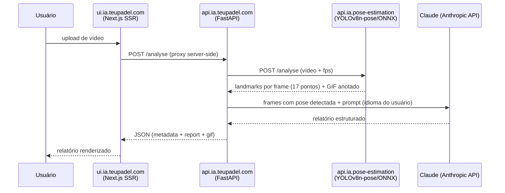

# teupadel.com

Análise de movimento de padel assistida por IA: o usuário sobe um vídeo de uma
jogada, a aplicação extrai a pose do jogador frame a frame e devolve um
relatório de feedback gerado por LLM — pontos positivos, pontos a melhorar e
sugestões por movimento.

## Componentes

| Repo | Papel | Stack |
|---|---|---|
| `ui.ia.teupadel.com` | Frontend público, institucional + ferramenta | Next.js 15 (App Router, SSR), `next-intl` (en/pt-pt/pt-br) |
| `api.ia.teupadel.com` | Orquestração: recebe vídeo, chama o processador de pose, chama o LLM, monta o relatório | FastAPI |
| `api.ia.pose-estimation` | Extração de pose por frame | ONNX Runtime + modelo YOLOv8n-pose |
| `gitops.teupadel.com` | Deploy dos dois componentes web (api + ui) | Helm (chart genérico) + ArgoCD |

## Fluxo de dados

A UI nunca fala diretamente com o processador de pose nem com a Anthropic API —
tudo passa por `api.ia.teupadel.com`, que é o único componente com acesso à
chave da Anthropic API.

## Landmarks extraídos

O processador de pose devolve 17 pontos por frame (`nose`, ombros, cotovelos,
pulsos, quadris, joelhos, tornozelos, olhos, orelhas), cada um com posição
normalizada (x, y) e confiança (`visibility`). Só frames com pose detectada são
enviados ao LLM, para manter o payload pequeno.

## Internacionalização

A UI serve três locales com prefixo de URL (`/en`, `/pt-pt`, `/pt-br`), cada um
com página institucional e página de ferramenta (`/analysis`). O parâmetro
`lang` é repassado até `api.ia.teupadel.com`, que o usa para gerar o relatório
no idioma correto — as chaves do JSON de resposta não mudam, só o conteúdo
textual dentro delas.

## Rede

Domínio próprio (`teupadel.com`), servido pela Gateway dedicada
`nginx-gateway-teupadel-com`. Só o frontend é exposto:

| Hostname | Componente |
|---|---|
| `www.teupadel.com` | `ui.ia.teupadel.com` |

`api.ia.teupadel.com` **não tem hostname público**. O browser só chama
`/analyse` no próprio servidor Next.js, e o Route Handler
(`src/app/analyse/route.js`) faz proxy server-side para o Service interno
`http://teupadel-api.teupadel.svc.cluster.local` — tráfego pod→pod, nunca sai do
cluster. Não há entrada `api.teupadel.com` no cloudflared.

Ver [Rede & Ingress](../architecture/networking.md) para o padrão de hostname
dedicado (sem reescrita de path).

## Segredos

`api.ia.teupadel.com` consome a chave da Anthropic API via `ExternalSecret`, a
partir do SSM Parameter Store — ver
[Secrets & Segurança](../architecture/secrets.md).

## Namespace e registry

Ambos os componentes web rodam no namespace `teupadel`, com imagens publicadas
no ECR (`<conta>.dkr.ecr.us-east-1.amazonaws.com/teupadel/api` e
`.../teupadel/ui`) pelo pipeline descrito em
[Build & Registry](../cicd/build-registry.md).
