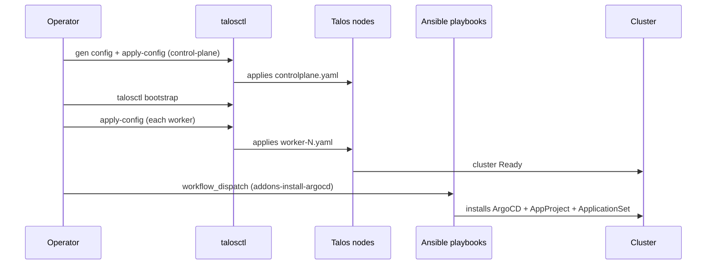

# Kubernetes Cluster (Talos)

The cluster runs **Talos Linux**, a minimal, immutable Kubernetes
distribution (no SSH, no shell — managed entirely through the `talosctl`
API). The `infra-as-code/homelab-bootsrap-k3s` repo holds the bootstrap
configuration; the repo name is historical, from an earlier, k3s-based
generation of the cluster.

## Topology

| Node | Hostname | Role | Hardware |
|---|---|---|---|
| 1 | `srv-k8s-master` | control-plane | dedicated mini PC (`192.168.1.10`) |
| 2 | `rasp-k8s-worker-1` | worker | Raspberry Pi |
| 3 | `rasp-k8s-worker-2` | worker | Raspberry Pi |
| 4 | `rasp-k8s-worker-3` | worker | Raspberry Pi |
| 5 | `proxmox-k8s-gpu-worker-1` | worker (GPU) | Proxmox VM with GPU passthrough |

The GPU worker is identified by a manual label
(`nvidia.com/gpu.present=true`) rather than automatic discovery — the
`nvidia-device-plugin` (installed via `gitops.core-addons`) exposes the GPU
as a schedulable resource based on that label, and the AI addons
(`gitops.ai-core-addons`) use a `nodeSelector` to pin inference workloads to
that node.

Low-resource nodes (the Raspberry Pis) get specific taints/labels
(`node.kubernetes.io/type: light`) to differentiate scheduling of light
workloads from heavier ones.

## Bootstrap

Each node's configuration (`talos/controlplane.yaml`,
`talos/worker-*.yaml`) is generated with `talosctl gen config` and
customized per node (static IP, hostname, network interface — `end0` on the
Raspberry Pis). Initial bootstrap and config application are manual
`talosctl` operations; what runs automated via CI is the next step:
installing/updating the cluster's base addons.

## Automation via GitHub Actions

Provisioning the nodes themselves (applying
`controlplane.yaml`/`worker-*.yaml`, `talosctl bootstrap`) is done directly
via `talosctl`, not Ansible — Talos has no SSH/shell, so there's nothing an
Ansible playbook would do at that level.

Ansible's role today is **downstream** of the cluster already existing:
installing and maintaining the base addons on top of an already-provisioned
Talos cluster. It runs from a self-hosted runner (a dedicated Raspberry Pi,
`rasp-ansible`), triggered by the **K3S Manager** workflow
(`workflow_dispatch`; the workflow's name is inherited from the cluster's
previous, k3s-based generation) — the action that matters today is
`addons-install-argocd`, which runs the playbooks responsible for
installing/updating ArgoCD and the base addons (`k8s-addons/argocd/`,
`k8s-addons/api-gateway/`, `k8s-addons/external-secrets/`). There's also the
**Fleet Maintenance** workflow, triggered by pushes to `maintenance/**`.

Neither one runs on a schedule — every base-addon change is an explicit
trigger.

## What bootstrap installs, and what becomes GitOps

On top of an already-running Talos cluster, Ansible installs only the
minimum needed for ArgoCD to exist and be able to manage itself from there
on:

1. ArgoCD (via Helm, official `argo/argo-cd` chart), with SSO through Dex
   connected to Microsoft Entra ID.
2. A single `AppProject` (`homelab`), permitting any repository in the
   `cmoreira-dev` org and any destination/resource in the cluster.
3. The `ApplicationSet/gitops-repos` — the auto-discovery trigger described
   in [GitOps pattern](../gitops/pattern.md).

From that point on, every additional addon (Gateway API, cert-manager,
External Secrets, monitoring, etc.) is delivered via GitOps, not Ansible —
see [Addon catalog](../gitops/addons.md).
