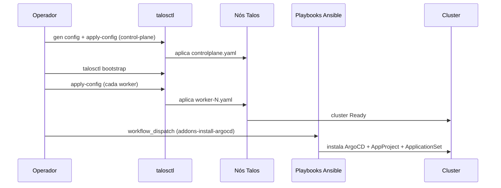

# Cluster Kubernetes (Talos)

O cluster roda **Talos Linux**, um Kubernetes distribution minimalista e
imutável (sem SSH, sem shell — gerenciado inteiramente via API `talosctl`). O
repo `infra-as-code/homelab-bootsrap-k3s` guarda a configuração de bootstrap;
o nome do repo é histórico, de uma geração anterior do cluster baseada em k3s.

## Topologia

| Nó | Hostname | Papel | Hardware |
|---|---|---|---|
| 1 | `srv-k8s-master` | control-plane | mini PC dedicado (`192.168.1.10`) |
| 2 | `rasp-k8s-worker-1` | worker | Raspberry Pi |
| 3 | `rasp-k8s-worker-2` | worker | Raspberry Pi |
| 4 | `rasp-k8s-worker-3` | worker | Raspberry Pi |
| 5 | `proxmox-k8s-gpu-worker-1` | worker (GPU) | VM no Proxmox, com passthrough de GPU |

O worker de GPU é identificado por um label manual (`nvidia.com/gpu.present=true`)
em vez de descoberta automática — o `nvidia-device-plugin` (instalado via
`gitops.core-addons`) expõe a GPU como recurso agendável a partir desse label, e
os addons de IA (`gitops.ai-core-addons`) usam `nodeSelector` para pinar cargas
de inferência nesse nó.

Nós de baixo recurso (os Raspberry Pi) recebem taints/labels específicos
(`node.kubernetes.io/type: light`) para diferenciar o scheduling de cargas leves
das cargas mais pesadas.

## Bootstrap

A configuração de cada nó (`talos/controlplane.yaml`, `talos/worker-*.yaml`) é
gerada com `talosctl gen config` e customizada por nó (IP estático, hostname,
interface de rede — `end0` nos Raspberry Pi). O bootstrap inicial e a aplicação
de config são operações manuais via `talosctl`; o que roda automatizado via CI é
a etapa seguinte: instalação/atualização dos addons base do cluster.

## Automação via GitHub Actions

O provisionamento dos nós em si (aplicar `controlplane.yaml`/`worker-*.yaml`,
`talosctl bootstrap`) é feito diretamente via `talosctl`, não via Ansible — Talos
não tem SSH/shell, então não há o que um playbook Ansible faria nesse nível.

O papel do Ansible hoje é **posterior** ao cluster já existir: instalar e manter
os addons base por cima de um Talos já provisionado. Ele roda a partir de um
runner self-hosted (um Raspberry Pi dedicado, `rasp-ansible`), acionado pelo
workflow **K3S Manager** (`workflow_dispatch`; o nome do workflow é herdado da
geração anterior do cluster, baseada em k3s) — a ação relevante hoje é
`addons-install-argocd`, que roda os playbooks responsáveis por instalar/atualizar
o ArgoCD e os addons base (`k8s-addons/argocd/`, `k8s-addons/api-gateway/`,
`k8s-addons/external-secrets/`). Há também o workflow **Fleet Maintenance**,
disparado por push em `maintenance/**`.

Nenhum dos dois roda em schedule — toda mudança de addon base é um gatilho
explícito.

## O que o bootstrap instala, e o que passa a ser GitOps

Sobre o cluster Talos já no ar, o Ansible instala apenas o mínimo necessário
para o ArgoCD existir e conseguir se auto-gerenciar a partir daí:

1. ArgoCD (via Helm, chart oficial `argo/argo-cd`), com SSO via Dex conectado ao
   Microsoft Entra ID.
2. Um `AppProject` único (`homelab`), com permissão para qualquer repositório da
   org `cmoreira-dev` e qualquer destino/recurso no cluster.
3. O `ApplicationSet/gitops-repos` — o gatilho de descoberta automática descrito
   em [Padrão GitOps](../gitops/pattern.md).

A partir desse ponto, todo addon adicional (Gateway API, cert-manager, External
Secrets, monitoramento, etc.) é entregue via GitOps, não via Ansible — ver
[Catálogo de addons](../gitops/addons.md).
