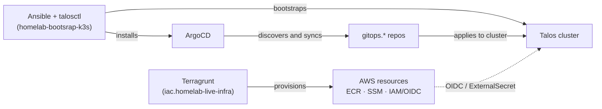

# Architecture overview

The homelab infra is split into four layers, each with its own tooling and
its own repository (or set of repositories):

| Layer | Tooling | Where it lives |
|---|---|---|
| Infrastructure provisioning | Terraform / Terragrunt | `infra-as-code/` |
| Cluster bootstrap | Ansible + `talosctl` | `infra-as-code/homelab-bootsrap-k3s` |
| Workload delivery (GitOps) | ArgoCD + Helm/Kustomize | `platform-engineering/gitops.*` |
| Applications | Docker + each repo's own CI | `teupadel.com/`, `sara/` |

Compute is hybrid: the Kubernetes cluster runs on owned hardware (a mini PC
plus Raspberry Pis, with one additional worker as a Proxmox VM for GPU),
while the components that make more sense managed live on AWS — image
registry (ECR), state backend (S3+DynamoDB), and secret storage (SSM
Parameter Store). Proxmox also hosts workloads outside the cluster, such as
the GitHub Actions self-hosted runner.

## The three questions the architecture answers

**"Where does the cluster run, and how does it exist?"** → [Kubernetes Cluster (Talos)](cluster.md)

**"How does a request from the internet reach a Pod?"** → [Networking & Ingress](networking.md)

**"Where do the secrets an app uses at runtime come from, and how does CI
authenticate without fixed credentials?"** → [Secrets & Security](secrets.md)

## How the layers relate

Terragrunt and Ansible only run on a manual trigger or `workflow_dispatch` —
there's no continuous reconciliation in those two layers. From ArgoCD
onward, everything is continuously reconciled: any drift between what's in
Git and what's running in the cluster gets reverted automatically
(`selfHeal: true`).
