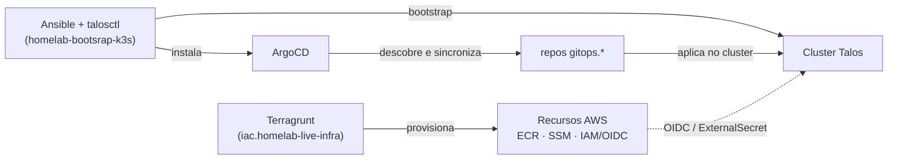

# Visão geral da arquitetura

A infra do homelab é dividida em quatro camadas, cada uma com sua própria
ferramenta e seu próprio repositório (ou conjunto de repositórios):

| Camada | Ferramenta | Onde vive |
|---|---|---|
| Provisionamento de infraestrutura | Terraform / Terragrunt | `infra-as-code/` |
| Bootstrap do cluster | Ansible + `talosctl` | `infra-as-code/homelab-bootsrap-k3s` |
| Entrega de workloads (GitOps) | ArgoCD + Helm/Kustomize | `platform-engineering/gitops.*` |
| Aplicações | Docker + CI próprio de cada repo | `teupadel.com/`, `sara/` |

O compute é híbrido: o cluster Kubernetes roda em hardware próprio (mini PC +
Raspberry Pis, com um worker adicional como VM no Proxmox para GPU), enquanto os
componentes que fazem mais sentido gerenciados ficam na AWS — registry de imagens
(ECR), backend de state (S3+DynamoDB) e armazenamento de segredos (SSM Parameter
Store). O Proxmox também hospeda cargas fora do cluster, como o runner self-hosted
do GitHub Actions.

## As três perguntas que a arquitetura responde

**"Onde o cluster roda e como ele existe?"** → [Cluster Kubernetes (Talos)](cluster.md)

**"Como um request da internet chega a um Pod?"** → [Rede & Ingress](networking.md)

**"De onde vêm os segredos que uma app usa em runtime, e como o CI se autentica
sem credenciais fixas?"** → [Secrets & Segurança](secrets.md)

## Relação entre as camadas

Terragrunt e Ansible só rodam sob gatilho manual ou `workflow_dispatch` — não há
reconciliação contínua nessas duas camadas. A partir do ArgoCD em diante, tudo é
reconciliado continuamente: qualquer divergência entre o que está no Git e o que
está rodando no cluster é revertida automaticamente (`selfHeal: true`).
