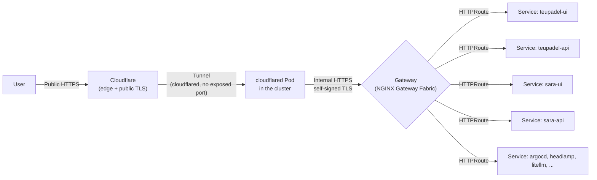

# Networking & Ingress

No port is opened directly on the home router. All external traffic comes in
through a **Cloudflare Tunnel**, which talks to a single entry point inside
the cluster: **NGINX Gateway Fabric**, implementing Kubernetes' Gateway API
(not classic Ingress, not Istio).



## Two Gateways, two domains

The cluster exposes two `Gateway` resources (Gateway API, defined in
`gitops.core-addons`), each owning a wildcard domain:

| Gateway | Domain | Used for |
|---|---|---|
| `nginx-gateway-cmoreira-dev` | `*.cmoreira.dev` | internal tools and Sara (`local.cmoreira.dev`, `argocd.cmoreira.dev`, `headlamp.cmoreira.dev`, `llm.cmoreira.dev`) |
| `nginx-gateway-teupadel-com` | `*.teupadel.com` | the public teupadel.com product (`www.teupadel.com`, `api.teupadel.com`) |

Each app declares its own `HTTPRoute` (via the
[generic app chart](../kubernetes/generic-app-chart.md)) pointing at one of
these two Gateways by name.

## TLS: two different levels

- **Public edge**: Cloudflare terminates the TLS the user sees — a public
  certificate, managed by Cloudflare.
- **Tunnel → Gateway**: `cloudflared` speaks HTTPS to the Gateway using a
  **self-signed** certificate (`cert-manager` with `ClusterIssuer/selfsigned`)
  and `noTLSVerify: true` on the tunnel side — this leg is internal to the
  cluster's network, so the certificate doesn't need to be publicly trusted,
  just encrypt the hop.

## Hostname routing (`cloudflared`)

`cloudflared` (also in `gitops.core-addons`) maps each public hostname to the
correct Gateway via SNI, inside the cluster itself — there is no public DNS
pointing directly at local-network IPs:

```yaml
ingress:
  - hostname: local.cmoreira.dev      → nginx-gateway-cmoreira-dev
  - hostname: argocd.cmoreira.dev     → nginx-gateway-cmoreira-dev
  - hostname: headlamp.cmoreira.dev   → nginx-gateway-cmoreira-dev
  - hostname: llm.cmoreira.dev        → nginx-gateway-cmoreira-dev
  - hostname: api.teupadel.com        → nginx-gateway-teupadel-com
  - hostname: www.teupadel.com        → nginx-gateway-teupadel-com
  - service: http_status:404          # fallback
```

## Two routing patterns per app

Within the same Gateway, an app can be exposed in two ways, and both coexist
in the cluster today:

**Dedicated hostname** (teupadel.com) — each component has its own subdomain
(`www.teupadel.com`, `api.teupadel.com`), no path rewriting. This is the
pattern for products with their own domain.

**Shared path** (Sara, under `local.cmoreira.dev`) — UI and API share the
same hostname, distinguished by path prefix (`/sara` for the UI,
`/sara/api` for the API). The Gateway API resolves the conflict by
longest-prefix-match, with no extra configuration. The UI needs to know it's
mounted under `/sara` (Next.js `basePath`); the API doesn't need to know
anything — the API's `HTTPRoute` strips the `/sara/api` prefix via
`URLRewrite` before forwarding, so the API's routes stay simple (`/health`,
`/search`, ...).

Which pattern to use is a per-app decision, made in each `gitops.<app>`'s
`values.yaml` (the `httpRoute` field) — see
[Generic app chart](../kubernetes/generic-app-chart.md).
