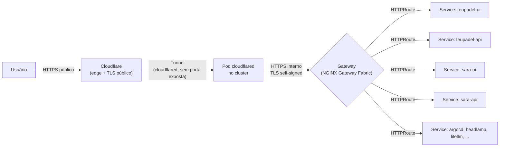

# Rede & Ingress

Nenhuma porta é aberta diretamente no roteador de casa. Todo o tráfego externo
entra via **Cloudflare Tunnel**, que fala com um único ponto de entrada dentro
do cluster: o **NGINX Gateway Fabric**, implementando a Gateway API do
Kubernetes (não Ingress clássico, não Istio).



## Duas Gateways, dois domínios

O cluster expõe dois `Gateway` (recurso da Gateway API, definidos em
`gitops.core-addons`), cada um dono de um domínio wildcard:

| Gateway | Domínio | Uso |
|---|---|---|
| `nginx-gateway-cmoreira-dev` | `*.cmoreira.dev` | ferramentas internas e Sara (`local.cmoreira.dev`, `argocd.cmoreira.dev`, `headlamp.cmoreira.dev`, `llm.cmoreira.dev`) |
| `nginx-gateway-teupadel-com` | `*.teupadel.com` | produto público teupadel.com (`www.teupadel.com`, `api.teupadel.com`) |

Cada app declara seu próprio `HTTPRoute` (via o
[chart genérico de apps](../kubernetes/generic-app-chart.md)) apontando para uma
dessas duas Gateways pelo nome.

## TLS: dois níveis diferentes

- **Borda pública**: a Cloudflare termina o TLS que o usuário vê — certificado
  público, gerenciado pela Cloudflare.
- **Túnel → Gateway**: o `cloudflared` fala HTTPS com o Gateway usando um
  certificado **self-signed** (`cert-manager` com `ClusterIssuer/selfsigned`) e
  `noTLSVerify: true` no lado do túnel — essa perna é interna à rede do cluster,
  então o certificado não precisa ser publicamente confiável, só criptografar o
  salto.

## Roteamento por hostname (`cloudflared`)

O `cloudflared` (também em `gitops.core-addons`) mapeia cada hostname público
para a Gateway correta via SNI, dentro do próprio cluster — não existe DNS
público apontando direto para IPs da rede local:

```yaml
ingress:
  - hostname: local.cmoreira.dev      → nginx-gateway-cmoreira-dev
  - hostname: argocd.cmoreira.dev     → nginx-gateway-cmoreira-dev
  - hostname: headlamp.cmoreira.dev   → nginx-gateway-cmoreira-dev
  - hostname: llm.cmoreira.dev        → nginx-gateway-cmoreira-dev
  - hostname: api.teupadel.com        → nginx-gateway-teupadel-com
  - hostname: www.teupadel.com        → nginx-gateway-teupadel-com
  - service: http_status:404          # fallback
```

## Dois padrões de roteamento por app

Dentro de uma mesma Gateway, uma app pode ser exposta de duas formas, e ambas
convivem hoje no cluster:

**Hostname dedicado** (teupadel.com) — cada componente tem seu próprio
subdomínio (`www.teupadel.com`, `api.teupadel.com`), sem reescrita de path. É o
padrão para produtos com domínio próprio.

**Path compartilhado** (Sara, sob `local.cmoreira.dev`) — UI e API dividem o
mesmo hostname, diferenciadas por prefixo de path (`/sara` para a UI,
`/sara/api` para a API). A Gateway API resolve o conflito por
longest-prefix-match, sem configuração extra. A UI precisa saber que está
montada sob `/sara` (`basePath` do Next.js); a API não precisa saber de nada —
o `HTTPRoute` da API remove o prefixo `/sara/api` via `URLRewrite` antes de
encaminhar, então as rotas da API continuam simples (`/health`, `/search`, ...).

Qual padrão usar é uma decisão por app, tomada no `values.yaml` de cada
`gitops.<app>` (campo `httpRoute`) — ver
[Chart genérico de apps](../kubernetes/generic-app-chart.md).
