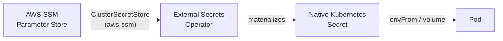

# Secrets & Security

Two rules followed across the whole infra: **no long-lived credential is ever
written to disk or to Git**, and **every secret consumer requests exactly
what it needs**, at the smallest possible scope.

## CI → AWS: OIDC, no access keys

The build/push workflows for the apps (`api.*`, `ui.*`) have no AWS access
key configured as a GitHub secret. Instead:

1. `infra-as-code/iac-aws-ecr-pipeline` provisions an **OIDC identity
   provider** for GitHub Actions in the AWS account, and an **IAM Role**
   assumable only by workflows running on the `main` branch of the
   authorized repos.
2. The reusable build/push workflow (`cmoreira-dev/.github`) exchanges the
   job's OIDC token for temporary credentials from that role, via
   `aws-actions/configure-aws-credentials`.
3. The credential expires with the job — nothing to rotate, nothing to leak.

More detail on this in [Build & Registry](../cicd/build-registry.md).

## Cluster → AWS: External Secrets Operator

Inside the cluster, no app injects its own secret in plaintext into any
manifest. The pattern is uniform across every app and addon:

- A `ClusterSecretStore` named `aws-ssm` (defined in `gitops.core-addons`) is
  the single connection point between the cluster and SSM Parameter Store.
- Each app declares an `ExternalSecret` (via the `externalSecrets` field of
  the [generic chart](../kubernetes/generic-app-chart.md)) pointing at the
  SSM parameter(s) it needs — for example, `api.ia.teupadel.com` references
  `/homelab/teupadel/anthropic-api-key`.
- The generated Secret lives only in the app's own namespace; there's no
  Secret shared between apps.
- Apps with no real secret (like `api.ia.local-sara`, a public scraper with
  no API key) simply don't enable `externalSecrets` — there's no empty
  Secret "by default."

## Pulling private ECR images

ECR is private; any app that needs to pull an image from it enables
`ecrPullSecret` in the generic chart, which generates a
`Secret/kubernetes.io/dockerconfigjson` from a `ClusterGenerator`
(`ecr-token`, managed in `gitops.core-addons`) — the token is fetched
dynamically from AWS, not a static credential copied into the cluster.

## Automatic image tag updates

`argocd-image-updater` (an addon in `gitops.core-addons`) has its own
credentials to read from ECR and write back to the `gitops.*` repos — also
via `ExternalSecret`, never copied manually.

## Human authentication: Microsoft Entra ID

The secrets above are all machine-to-machine. For **human** access, the
pattern is different: tools with broad privilege over the infra are
federated through **Microsoft Entra ID** — no local password to manage or
rotate.

| Tool | Mechanism |
|---|---|
| ArgoCD | SSO via Dex, connected to Entra ID |
| Headlamp | Direct OIDC against Entra ID (`headlamp.config.oidc`) |
| AWS account | Federated login via Entra ID |

This pattern is reserved for the two clouds (AWS and Entra ID/Azure itself)
and for the tools that grant broad access to the cluster (ArgoCD, Headlamp).
Everything else — the applications (`teupadel.com`, Sara) and the addons
with no admin console — is local infrastructure, with no Entra ID
integration: either they expose no login at all, or they aren't surfaces an
operator needs to authenticate against.

## Summary by credential type

| Credential | Source of truth | How it reaches the consumer |
|---|---|---|
| AWS deploy (app CI) | IAM Role (OIDC) | Assumed per job, expires with the job |
| App API keys (e.g. Anthropic) | AWS SSM Parameter Store | `ExternalSecret` → Secret in the app's namespace |
| ECR image pull | Dynamic token via `ClusterGenerator` | `ExternalSecret` → `dockerconfigjson` |
| ArgoCD login | Microsoft Entra ID (Dex) | Federated login, no local password |
| Headlamp login | Microsoft Entra ID (OIDC) | Federated login, no local password |
| AWS console/CLI login | Microsoft Entra ID | Federated login, no long-lived access key |
