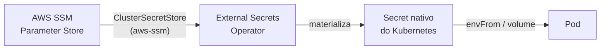

# Secrets & Segurança

Duas regras seguidas em toda a infra: **nenhuma credencial de longa duração
fica gravada em disco ou em Git**, e **cada consumidor de segredo pede
exatamente o que precisa**, no menor escopo possível.

## CI → AWS: OIDC, sem access keys

Os workflows de build/push das apps (`api.*`, `ui.*`) não têm nenhuma AWS
access key configurada como secret do GitHub. Em vez disso:

1. `infra-as-code/iac-aws-ecr-pipeline` provisiona um **OIDC identity provider**
   do GitHub Actions na conta AWS, e uma **IAM Role** assumível apenas por
   workflows rodando na branch `main` dos repos autorizados.
2. O workflow reutilizável de build/push (`cmoreira-dev/.github`) troca o token
   OIDC do job por credenciais temporárias dessa role, via
   `aws-actions/configure-aws-credentials`.
3. A credencial expira com o job — nada para rotacionar, nada para vazar.

Isso está descrito com mais detalhe em [Build & Registry](../cicd/build-registry.md).

## Cluster → AWS: External Secrets Operator

Dentro do cluster, nenhuma app injeta o próprio segredo em texto puro em manifest
algum. O padrão, uniforme em todos os apps e addons:

- Um `ClusterSecretStore` chamado `aws-ssm` (definido em `gitops.core-addons`) é
  o único ponto de conexão entre o cluster e o SSM Parameter Store.
- Cada app declara um `ExternalSecret` (via o campo `externalSecrets` do
  [chart genérico](../kubernetes/generic-app-chart.md)) apontando para o(s)
  parâmetro(s) SSM que precisa — por exemplo, `api.teupadel.com` referencia
  `/homelab/teupadel/anthropic-api-key`.
- O Secret gerado vive só no namespace da app; não há um Secret compartilhado
  entre apps.
- Apps sem segredo real (como `api.ia.local-sara`, um scraper público sem chave
  de API) simplesmente não habilitam `externalSecrets` — não existe um Secret
  vazio "por padrão".

## Pull de imagens privadas do ECR

O ECR é privado; cada app que precisa puxar imagem de lá habilita
`ecrPullSecret` no chart genérico, que gera um
`Secret/kubernetes.io/dockerconfigjson` a partir de um `ClusterGenerator`
(`ecr-token`, gerenciado em `gitops.core-addons`) — o token é obtido
dinamicamente da AWS, não é uma credencial estática copiada para o cluster.

## Atualização automática de tag de imagem

O `argocd-image-updater` (addon em `gitops.core-addons`) tem credenciais próprias
para ler o ECR e escrever de volta nos repos `gitops.*` — também via
`ExternalSecret`, nunca copiadas manualmente.

## Autenticação humana: Microsoft Entra ID

Os segredos acima são todos máquina-a-máquina. Para acesso **humano**, o
padrão é diferente: as ferramentas com privilégio amplo sobre a infra são
federadas via **Microsoft Entra ID** — sem senha local para gerenciar ou
rotacionar.

| Ferramenta | Mecanismo |
|---|---|
| ArgoCD | SSO via Dex, conectado ao Entra ID |
| Headlamp | OIDC direto contra o Entra ID (`headlamp.config.oidc`) |
| Conta AWS | Login federado via Entra ID |

Esse padrão é reservado às duas nuvens (AWS e o próprio Entra ID/Azure) e às
ferramentas que dão acesso amplo ao cluster (ArgoCD, Headlamp). Tudo o mais —
as aplicações (`teupadel.com`, Sara) e os addons sem console administrativo —
é infraestrutura local, sem integração com o Entra ID: ou não expõem login
nenhum, ou não são superfícies que um operador precise autenticar para
acessar.

## Resumo por tipo de credencial

| Credencial | Onde mora a fonte | Como chega ao consumidor |
|---|---|---|
| Deploy AWS (CI de app) | IAM Role (OIDC) | Assumida por job, expira com o job |
| Chaves de API de app (ex.: Anthropic) | AWS SSM Parameter Store | `ExternalSecret` → Secret no namespace da app |
| Pull de imagem ECR | Token dinâmico via `ClusterGenerator` | `ExternalSecret` → `dockerconfigjson` |
| Login no ArgoCD | Microsoft Entra ID (Dex) | Login federado, sem senha local |
| Login no Headlamp | Microsoft Entra ID (OIDC) | Login federado, sem senha local |
| Login no console/CLI AWS | Microsoft Entra ID | Login federado, sem access key de longa duração |
