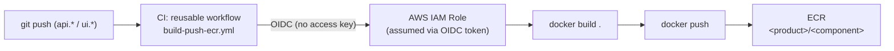

# Build & Registry

Every `api.*`/`ui.*` repo publishes its Docker image to **Amazon ECR**,
through a reusable workflow maintained in the org's `.github` repo — the
same CI definition serves every component.

## Pipeline

## Authentication: OIDC, not static credentials

The GitHub Actions OIDC identity provider and the assumable IAM Role are
provisioned by the
[`iac-aws-ecr-pipeline`](../iac/modules.md#iac-aws-ecr-pipeline) module,
consumed in `iac.homelab-live-infra`. The Role can only be assumed by
workflows running on the `main` branch of the explicitly authorized
repositories (`github_repos`/`ecr_products`) — today `teupadel`
(`api.ia.teupadel.com`, `ui.ia.teupadel.com`) and `sara`
(`api.ia.local-sara`, `ui.ia.local-sara`).

No `AWS_ACCESS_KEY_ID`/`AWS_SECRET_ACCESS_KEY` is stored as a repository
secret — the credential is temporary and expires with the job.

## Repository creation on demand

ECR uses `aws_ecr_repository_creation_template` per product — the image
repository (e.g. `teupadel/api`) is born automatically on the first
`docker push` (`CREATE_ON_PUSH`), with no need to declare each component
individually in Terraform.

## One build quirk: no `--build-arg`

The reusable workflow runs a plain `docker build .`, with no
`--build-arg` support. That means **each `Dockerfile`'s `ARG ...=default`
values are exactly what ships to production** — build-time variables (like
`NEXT_PUBLIC_API_URL` or a Next.js UI's `basePath`) aren't injectable at CI
time; they need to be correct as the default in the repo's own
`Dockerfile`. For local development, `docker-compose.yml` overrides those
`ARG`s with local values via `build.args`.

## From new image to running in the cluster

Publishing a new image to ECR doesn't sync anything on its own —
`argocd-image-updater` (an addon in `gitops.core-addons`) is what watches
the registry and writes the new tag back into the matching `gitops.<app>`
repo, which then kicks off the normal GitOps flow — see
[From push to cluster](deploy-flow.md).
