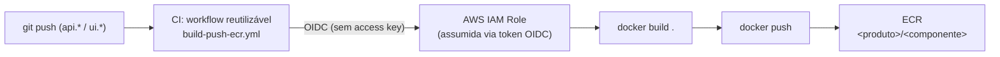

# Build & Registry

Todo repo `api.*`/`ui.*` publica sua imagem Docker no **Amazon ECR**, através
de um workflow reutilizável mantido no repo `.github` da org — a mesma
definição de CI serve todos os componentes.

## Pipeline

## Autenticação: OIDC, não credenciais estáticas

O identity provider OIDC do GitHub Actions e a IAM Role assumível por ele são
provisionados pelo módulo
[`iac-aws-ecr-pipeline`](../iac/modules.md#iac-aws-ecr-pipeline), consumido em
`iac.homelab-live-infra`. A Role só pode ser assumida por workflows rodando na
branch `main` dos repositórios explicitamente autorizados
(`github_repos`/`ecr_products`) — hoje `teupadel` (`api.ia.teupadel.com`,
`ui.ia.teupadel.com`) e `sara` (`api.ia.local-sara`, `ui.ia.local-sara`).

Nenhum `AWS_ACCESS_KEY_ID`/`AWS_SECRET_ACCESS_KEY` é armazenado como secret de
repositório — a credencial é temporária e expira com o job.

## Criação de repositório sob demanda

O ECR usa `aws_ecr_repository_creation_template` por produto — o repositório de
imagem (ex.: `teupadel/api`) nasce automaticamente no primeiro `docker push`
(`CREATE_ON_PUSH`), sem precisar declarar cada componente individualmente no
Terraform.

## Uma particularidade do build: sem `--build-arg`

O workflow reutilizável roda `docker build .` puro, sem suporte a
`--build-arg`. Isso significa que **os valores `ARG ...=default` de cada
`Dockerfile` são exatamente os valores que vão para produção** — variáveis de
build-time (como `NEXT_PUBLIC_API_URL` ou `basePath` de uma UI Next.js) não são
injetáveis em tempo de CI; precisam estar corretas como default no próprio
`Dockerfile` do repo. Para desenvolvimento local, `docker-compose.yml`
sobrescreve esses `ARG`s com valores locais via `build.args`.

## Da imagem nova ao cluster

Publicar uma imagem nova no ECR não sincroniza nada sozinho — o
`argocd-image-updater` (addon em `gitops.core-addons`) é quem observa o
registro e escreve a nova tag de volta no repo `gitops.<app>` correspondente,
o que então dispara o fluxo normal de GitOps — ver
[Do push ao cluster](deploy-flow.md).
