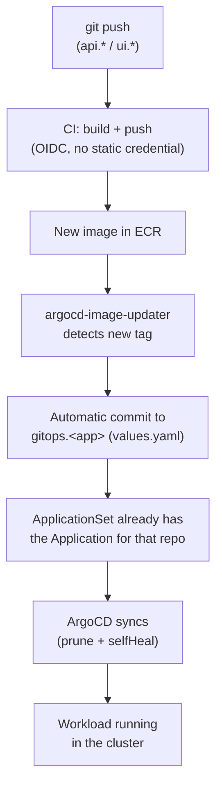

# From push to cluster

End-to-end view of how a code change reaches the cluster, tying together
[Build & Registry](build-registry.md) and the
[GitOps pattern](../gitops/pattern.md).

## Two different deploy triggers

Worth noting that there are two kinds of change that lead to a deploy, and
each enters the flow at a different point:

- **App code change** (`api.*`/`ui.*`) — triggers the build CI, which
  publishes a new image; from there, `argocd-image-updater` is what updates
  the `gitops.*` repo, with no manual intervention.
- **Deploy configuration change** (`values.yaml`, `Chart.yaml`, a new
  `HTTPRoute`) — made directly in the `gitops.*` repo; doesn't go through
  `argocd-image-updater`, only through ArgoCD.

In both cases, what actually applies to the cluster is always ArgoCD reading
the `gitops.*` repo — never a deploy step inside the app's own CI.

## No explicit deploy step

Notice that at no point is there a `kubectl apply`, a manual
`helm upgrade`, or a "deploy" step inside an app's CI workflow. CI only
knows how to build and publish an image; everything from there on is
ArgoCD's continuous reconciliation against what's declared in Git.
