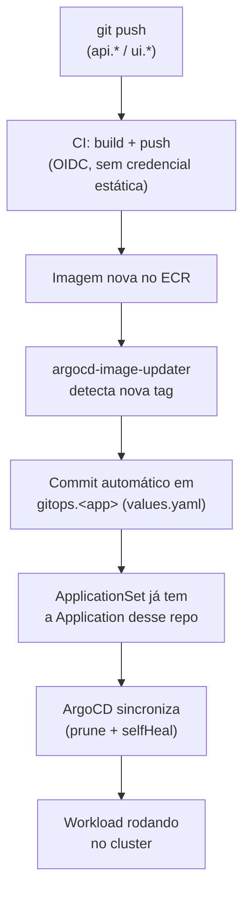

# Do push ao cluster

Visão ponta a ponta de como uma mudança de código chega a rodar no cluster,
juntando [Build & Registry](build-registry.md) e o
[Padrão GitOps](../gitops/pattern.md).

## Dois gatilhos de deploy diferentes

Vale notar que existem dois tipos de mudança que levam a um deploy, e cada um
entra no fluxo em um ponto diferente:

- **Mudança de código de uma app** (`api.*`/`ui.*`) — dispara o CI de build,
  que publica imagem nova; a partir daí o `argocd-image-updater` é quem
  atualiza o repo `gitops.*`, sem intervenção manual.
- **Mudança de configuração de deploy** (`values.yaml`, `Chart.yaml`, um novo
  `HTTPRoute`) — é feita direto no repo `gitops.*`; não passa pelo
  `argocd-image-updater`, só pelo ArgoCD.

Em ambos os casos, o que efetivamente aplica no cluster é sempre o ArgoCD lendo
o repo `gitops.*` — nunca um passo de deploy dentro do próprio CI da app.

## Sem passo de deploy explícito

Repare que em nenhum momento existe um `kubectl apply`, um `helm upgrade`
manual, ou um step de "deploy" dentro do workflow de CI de uma app. O CI só
sabe construir e publicar imagem; tudo daí em diante é reconciliação contínua
do ArgoCD contra o que está declarado em Git.
