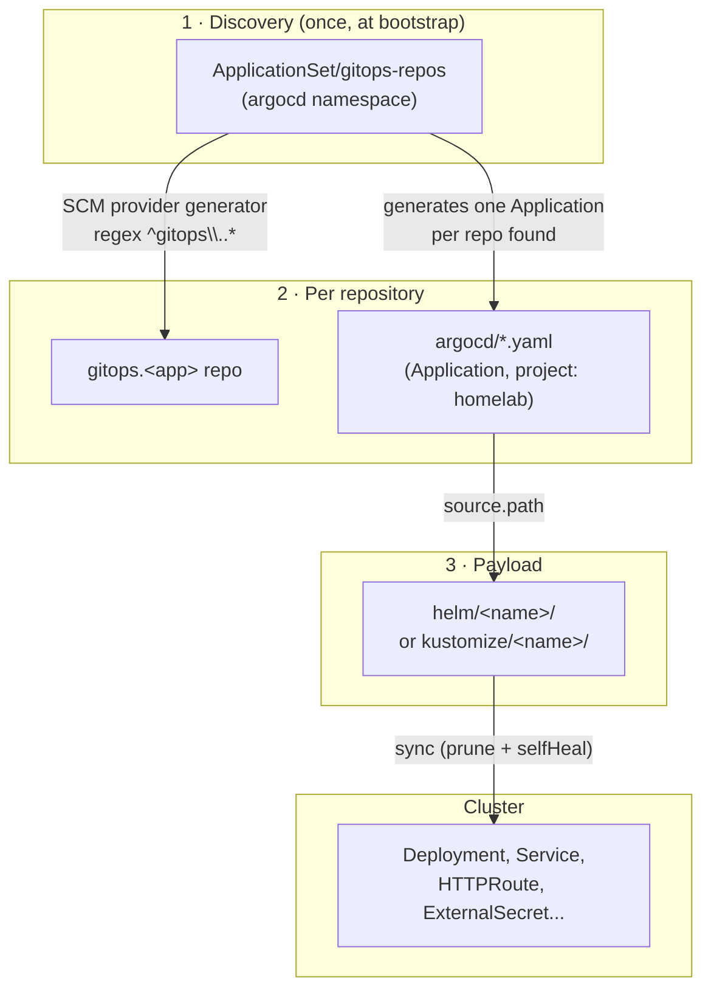
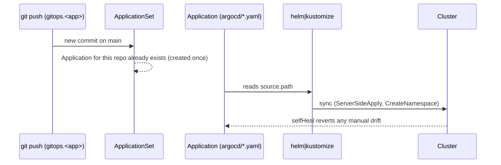

# GitOps pattern

Every workload deployment in the cluster follows the same mechanism, in
three layers. There's no manual `kubectl apply`, no deploy step inside a CI
pipeline — **a `git push` to the `main` branch of a `gitops.*` repo is the
entire deploy mechanism**.

## Layer 1 — Automatic discovery

The `ApplicationSet/gitops-repos`, installed once at cluster bootstrap (see
[Cluster bootstrap](../iac/bootstrap.md)), uses an `scmProvider` generator
against the `cmoreira-dev` GitHub org, filtering repositories matching
`^gitops\..*`, re-polling every 300s.

For every repository found, the `ApplicationSet` automatically creates an
`Application` (named after the repo) pointed at the `argocd/` folder
**inside that repo**, with `CreateNamespace=true` and automated sync
(`prune` + `selfHeal`).

## Layer 2 — Per-repository manifests

Inside each `gitops.<app>` repo, the `argocd/` folder holds one or more
`Application` manifests, using `project: homelab` (the `AppProject` created
at bootstrap, with broad permissions over the org and the cluster) and
pointing back at a folder within the **same repository** — `helm/<name>` or
`kustomize/<name>`.

Most repos have an essentially empty `argocd/` (just `.gitkeep`), because
the Application generated by Layer 1 already covers one workload per repo.
`argocd/` is only populated manually when a repo delivers **more than one
component** — for example `gitops.teupadel.com` and `gitops.local-sara`
declare two Applications (`<app>-api` and `<app>-ui`), each with its own
`helm/api`/`helm/ui`.

## Layer 3 — Payload

The content actually applied to the cluster: a Helm chart (usually a thin
wrapper chart with `dependencies:` on an upstream chart, or on the
[generic app chart](../kubernetes/generic-app-chart.md)) or plain Kustomize
manifests. `sync-wave` annotations sequence installs that depend on each
other (e.g. CRDs/operator before the resources that use them).

## Full sequence, from push to running workload

## Dependency automation

Every `gitops.*` repo with a `helm/` folder has a `renovate.json`
(`helmv3` manager, scoped to `helm/**`) — Renovate automatically opens PRs
when a chart dependency has a new version. Merging the PR is what actually
promotes the update, since the merge to `main` is itself the deploy trigger.
