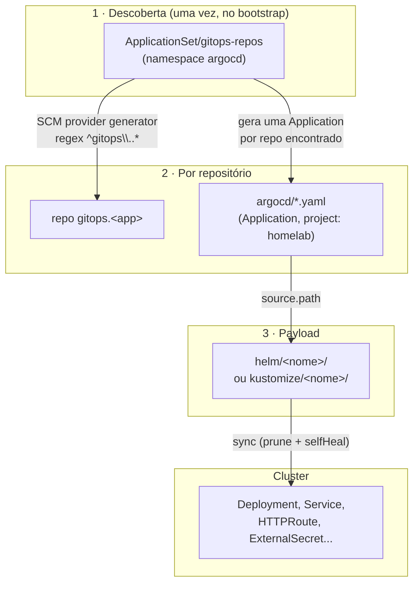
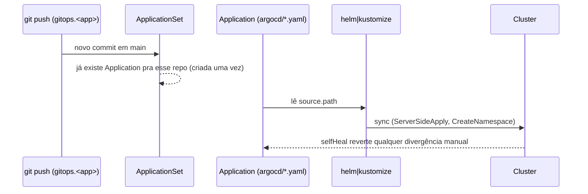

# Padrão GitOps

Todo deploy de workload no cluster segue o mesmo mecanismo, em três camadas.
Não existe `kubectl apply` manual nem passo de deploy dentro de um pipeline de
CI — **um `git push` na branch `main` de um repo `gitops.*` é o mecanismo de
deploy inteiro**.

## Camada 1 — Descoberta automática

O `ApplicationSet/gitops-repos`, instalado uma única vez no bootstrap do
cluster (ver [Bootstrap do cluster](../iac/bootstrap.md)), usa um gerador
`scmProvider` contra a org GitHub `cmoreira-dev`, filtrando repositórios que
casam com `^gitops\..*`, reconsultando a cada 300s.

Para cada repositório encontrado, o `ApplicationSet` cria automaticamente uma
`Application` (nome = nome do repo) apontada para a pasta `argocd/` **daquele
repo**, com `CreateNamespace=true` e sync automático (`prune` + `selfHeal`).

## Camada 2 — Manifests por repositório

Dentro de cada repo `gitops.<app>`, a pasta `argocd/` contém um ou mais
manifests `Application`, usando `project: homelab` (o `AppProject` criado no
bootstrap, com permissão ampla sobre a org e o cluster) e apontando de volta
para uma pasta dentro do **mesmo repositório** — `helm/<nome>` ou
`kustomize/<nome>`.

A maioria dos repos tem `argocd/` praticamente vazio (só `.gitkeep`), porque a
Application gerada pela Camada 1 já cobre um workload por repo. `argocd/` só é
populado manualmente quando um repo entrega **mais de um componente** — por
exemplo `gitops.teupadel.com` e `gitops.local-sara` declaram duas Applications
(`<app>-api` e `<app>-ui`), cada uma com seu próprio `helm/api`/`helm/ui`.

## Camada 3 — Payload

O conteúdo de fato aplicado no cluster: um chart Helm (geralmente uma thin
wrapper chart com `dependencies:` sobre um chart upstream, ou sobre o
[chart genérico de apps](../kubernetes/generic-app-chart.md)) ou manifests
Kustomize puros. Anotações `sync-wave` sequenciam instalações com dependência
entre si (ex.: CRDs/operador antes dos recursos que os usam).

## Sequência completa, do push ao workload rodando

## Automação de dependências

Todo repo `gitops.*` com pasta `helm/` tem `renovate.json` (manager `helmv3`,
escopo `helm/**`) — o Renovate abre PRs automaticamente quando uma dependência
de chart tem nova versão. Mesclar o PR é o que efetivamente promove a
atualização, já que o próprio merge em `main` é o gatilho de deploy.
