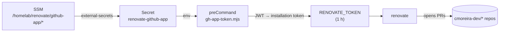

# Renovate (dependency updates)

[Renovate](https://docs.renovatebot.com) runs **self-hosted**, as a `CronJob`
in the cluster (in `gitops.core-addons`, `helm/renovate`), opening dependency
bump PRs across the whole `cmoreira-dev` org.

- **When**: 03:00 daily (`Europe/Lisbon`).
- **Scope**: `autodiscover` filtered to `cmoreira-dev/*`, excluding
  `backstage.homelab` (see [two instances](#two-instances-shared-vs-backstage-homelab)
  below).
- **Onboarding**: `true` — a new repo automatically gets a *"Configure
  Renovate"* PR with a starter `renovate.json` (`extends:
  ["config:recommended"]`). Until that PR is merged, Renovate does nothing in
  the repo.
- Each repo tunes the rest in its own `renovate.json` (see the
  [GitOps pattern](pattern.md) for the `gitops.*` repos: `helmv3` manager,
  `helm/**` scope, per-chart groups).

## Two instances: shared vs. backstage.homelab

The chart (`helm/renovate`) is deployed **twice**, as two separate Argo CD
Applications sharing the same chart code but with different values files and
namespaces:

| Instance | Application / namespace | Values | Schedule | Memory limit |
|---|---|---|---|---|
| Shared | `renovate` / `renovate` | `values.yaml` | 03:00 | 2Gi |
| Backstage-dedicated | `renovate-backstage` / `renovate-backstage` | `values.yaml` + `values-backstage.yaml` | 04:00 | 4Gi |

**Why the split**: `backstage.homelab` is the only `npm`-managed repo in the
org (a yarn-workspaces monorepo, `packages/*` + `plugins/*`) — every other
repo Renovate scans is a `gitops.*` chart with a single Helm dependency.
Renovate's `npm` manager keeps registry/changelog lookups for every dependency
in memory during extraction, which OOMKilled the shared instance's 2Gi limit
job every night. Rather than raising the shared instance's memory (which
would keep growing as Backstage's dependency tree grows, and affects every
other repo's job too), `backstage.homelab` is excluded from the shared
instance's `autodiscoverFilter` with a negated entry
(`"!cmoreira-dev/backstage.homelab"`) and scanned instead by a
second, dedicated instance with `autodiscover: false` +
`"repositories": ["cmoreira-dev/backstage.homelab"]` and a much higher memory
ceiling. The two crons are staggered by an hour so they never compete for
resources on the same ARM64 worker at once.

Both instances share the same GitHub App installation token flow
(`renovate-github-app` secret, `gh-app-token.mjs`) — each namespace gets its
own copy of the `ExternalSecret`/`ConfigMap` (namespaced via
`{{ include "renovate.namespace" . }}` in the chart templates, not hardcoded),
so no cross-namespace resource collision.

## Authentication — GitHub App, no PAT

OSS Renovate (the binary the chart runs) has **no native GitHub App support** —
it only takes a token, and installation tokens expire after 1 h. So the
`cronjob.preCommand` runs a Node script
(`templates/gh-app-token-configmap.yaml`) at the start of every run: it builds
the `renovate-cmoreira-dev` App JWT, resolves the org installation, mints a
fresh installation token and exports it as `RENOVATE_TOKEN`.



App credentials:

| SSM parameter | value |
|---|---|
| `/homelab/renovate/github-app/id` | App ID |
| `/homelab/renovate/github-app/private-key` | the `.pem` (PKCS#1) |

The App must be **installed on the org** — with no installation the job fails
with `gh-app-token: no installation of app <id> on org cmoreira-dev`.

## Guards

- **`generic-app` (minor/major)** — held behind *Dependency Dashboard
  approval*. The `ui.ia.*` images still run as root on `:80`, so adopting the
  [generic chart](../kubernetes/generic-app-chart.md) 0.4.0 (`restricted`
  securityContext) needs a Dockerfile fix first — the rule keeps a grouped helm
  PR from merging that bump unattended.
- `major` updates in general (in the `gitops.*` repos) sit behind a dashboard
  checkbox.

## Operating it

```bash
# force a run now (shared instance)
kubectl -n renovate create job --from=cronjob/renovate renovate-manual-$(date +%s)
kubectl -n renovate logs -f job/renovate-manual-...

# force a run now (backstage.homelab-dedicated instance)
kubectl -n renovate-backstage create job --from=cronjob/renovate-backstage renovate-backstage-manual-$(date +%s)
kubectl -n renovate-backstage logs -f job/renovate-backstage-manual-...
```

The Dependency Dashboard (an issue in each repo) shows what's pending and what
is waiting for approval.
