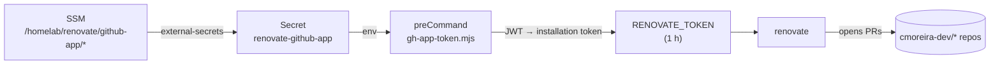

# Renovate (dependency updates)

[Renovate](https://docs.renovatebot.com) runs **self-hosted**, as a `CronJob`
in the cluster (in `gitops.core-addons`, `helm/renovate`), opening dependency
bump PRs across the whole `cmoreira-dev` org.

- **When**: 03:00 daily (`Europe/Lisbon`).
- **Scope**: `autodiscover` filtered to `cmoreira-dev/*`.
- **Onboarding**: `true` — a new repo automatically gets a *"Configure
  Renovate"* PR with a starter `renovate.json` (`extends:
  ["config:recommended"]`). Until that PR is merged, Renovate does nothing in
  the repo.
- Each repo tunes the rest in its own `renovate.json` (see the
  [GitOps pattern](pattern.md) for the `gitops.*` repos: `helmv3` manager,
  `helm/**` scope, per-chart groups).

## Authentication — GitHub App, no PAT

OSS Renovate (the binary the chart runs) has **no native GitHub App support** —
it only takes a token, and installation tokens expire after 1 h. So the
`cronjob.preCommand` runs a Node script
(`templates/gh-app-token-configmap.yaml`) at the start of every run: it builds
the `renovate-cmoreira-dev` App JWT, resolves the org installation, mints a
fresh installation token and exports it as `RENOVATE_TOKEN`.



App credentials:

| SSM parameter | value |
|---|---|
| `/homelab/renovate/github-app/id` | App ID |
| `/homelab/renovate/github-app/private-key` | the `.pem` (PKCS#1) |

The App must be **installed on the org** — with no installation the job fails
with `gh-app-token: no installation of app <id> on org cmoreira-dev`.

## Guards

- **`generic-app` (minor/major)** — held behind *Dependency Dashboard
  approval*. The `ui.ia.*` images still run as root on `:80`, so adopting the
  [generic chart](../kubernetes/generic-app-chart.md) 0.4.0 (`restricted`
  securityContext) needs a Dockerfile fix first — the rule keeps a grouped helm
  PR from merging that bump unattended.
- `major` updates in general (in the `gitops.*` repos) sit behind a dashboard
  checkbox.

## Operating it

```bash
# force a run now
kubectl -n renovate create job --from=cronjob/renovate renovate-manual-$(date +%s)
kubectl -n renovate logs -f job/renovate-manual-...
```

The Dependency Dashboard (an issue in each repo) shows what's pending and what
is waiting for approval.
