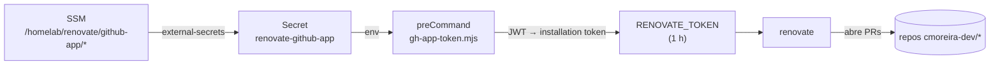

# Renovate (atualização de dependências)

O [Renovate](https://docs.renovatebot.com) roda **self-hosted**, como um
`CronJob` no cluster (em `gitops.core-addons`, `helm/renovate`), e abre PRs de
bump de dependência em toda a org `cmoreira-dev`.

- **Quando**: 03:00 diário (`Europe/Lisbon`).
- **Escopo**: `autodiscover` filtrado a `cmoreira-dev/*`.
- **Onboarding**: `true` — um repo novo recebe automaticamente um PR
  *"Configure Renovate"* com um `renovate.json` inicial (`extends:
  ["config:recommended"]`). Enquanto esse PR não for mergeado, o Renovate não
  age no repo.
- Cada repo afina o resto no seu próprio `renovate.json` (ver
  [Padrão GitOps](pattern.md) para os `gitops.*`: manager `helmv3`, escopo
  `helm/**`, grupos por chart).

## Autenticação — GitHub App, sem PAT

O Renovate OSS (o binário que o chart roda) **não tem suporte nativo a GitHub
App** — só aceita um token, e tokens de instalação expiram em 1 h. Então o
`cronjob.preCommand` corre um script Node
(`templates/gh-app-token-configmap.yaml`) no arranque de cada execução: monta o
JWT do App `renovate-cmoreira-dev`, resolve a instalação na org, gera um
*installation token* fresco e exporta-o como `RENOVATE_TOKEN`.



Credenciais do App:

| SSM parameter | valor |
|---|---|
| `/homelab/renovate/github-app/id` | App ID |
| `/homelab/renovate/github-app/private-key` | o `.pem` (PKCS#1) |

O App tem de estar **instalado na org** — sem instalação, o job falha com
`gh-app-token: no installation of app <id> on org cmoreira-dev`.

## Guardas

- **`generic-app` (minor/major)** — segurado atrás de *Dependency Dashboard
  approval*. As imagens `ui.ia.*` ainda correm como root na `:80`, então adotar
  o [chart genérico](../kubernetes/generic-app-chart.md) 0.4.0 (securityContext
  `restricted`) exige corrigir o Dockerfile primeiro — a regra impede que um PR
  agrupado de helm mergeie esse bump sem supervisão.
- `major` em geral (nos `gitops.*`) fica atrás de checkbox no dashboard.

## Operação

```bash
# forçar uma execução agora
kubectl -n renovate create job --from=cronjob/renovate renovate-manual-$(date +%s)
kubectl -n renovate logs -f job/renovate-manual-...
```

O *Dependency Dashboard* (uma issue em cada repo) mostra o que está pendente e
o que espera aprovação.
