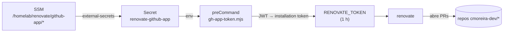

# Renovate (atualização de dependências)

O [Renovate](https://docs.renovatebot.com) roda **self-hosted**, como um
`CronJob` no cluster (em `gitops.core-addons`, `helm/renovate`), e abre PRs de
bump de dependência em toda a org `cmoreira-dev`.

- **Quando**: 03:00 diário (`Europe/Lisbon`).
- **Escopo**: `autodiscover` filtrado a `cmoreira-dev/*`, excluindo
  `backstage.homelab` (ver [duas instâncias](#duas-instancias-geral-vs-backstagehomelab)
  abaixo).
- **Onboarding**: `true` — um repo novo recebe automaticamente um PR
  *"Configure Renovate"* com um `renovate.json` inicial (`extends:
  ["config:recommended"]`). Enquanto esse PR não for mergeado, o Renovate não
  age no repo.
- Cada repo afina o resto no seu próprio `renovate.json` (ver
  [Padrão GitOps](pattern.md) para os `gitops.*`: manager `helmv3`, escopo
  `helm/**`, grupos por chart).

## Duas instâncias: geral vs. backstage.homelab

O chart (`helm/renovate`) é implantado **duas vezes**, como duas Applications
Argo CD separadas que partilham o mesmo código de chart mas com values files e
namespaces diferentes:

| Instância | Application / namespace | Values | Schedule | Limite de memória |
|---|---|---|---|---|
| Geral | `renovate` / `renovate` | `values.yaml` | 03:00 | 2Gi |
| Dedicada ao backstage | `renovate-backstage` / `renovate-backstage` | `values.yaml` + `values-backstage.yaml` | 04:00 | 4Gi |

**Por que a divisão**: `backstage.homelab` é o único repo da org gerido pelo
manager `npm` (um monorepo yarn workspaces, `packages/*` + `plugins/*`) —
todos os outros repos escaneados pelo Renovate são charts `gitops.*` com uma
única dependência Helm. O manager `npm` do Renovate mantém em memória os
lookups de registry/changelog de cada dependência durante a extração, o que
estourava o limite de 2Gi da instância geral todas as noites (`OOMKilled`).
Em vez de subir a memória da instância geral (que só cresceria conforme a
árvore de dependências do Backstage cresce, e afeta o job de todos os outros
repos), o `backstage.homelab` é excluído do `autodiscoverFilter` da instância
geral com uma entrada negada (`"!cmoreira-dev/backstage.homelab"`) e passa a
ser escaneado por uma segunda instância dedicada, com `autodiscover: false` +
`"repositories": ["cmoreira-dev/backstage.homelab"]` e um teto de memória bem
mais alto. Os dois crons ficam desfasados em uma hora para nunca competirem
por recursos no mesmo worker ARM64 ao mesmo tempo.

As duas instâncias partilham o mesmo fluxo de token via GitHub App
(`renovate-github-app` secret, `gh-app-token.mjs`) — cada namespace recebe a
sua própria cópia do `ExternalSecret`/`ConfigMap` (namespaced via
`{{ include "renovate.namespace" . }}` nos templates do chart, não fixo no
YAML), sem colisão de recursos entre namespaces.

## Autenticação — GitHub App, sem PAT

O Renovate OSS (o binário que o chart roda) **não tem suporte nativo a GitHub
App** — só aceita um token, e tokens de instalação expiram em 1 h. Então o
`cronjob.preCommand` corre um script Node
(`templates/gh-app-token-configmap.yaml`) no arranque de cada execução: monta o
JWT do App `renovate-cmoreira-dev`, resolve a instalação na org, gera um
*installation token* fresco e exporta-o como `RENOVATE_TOKEN`.



Credenciais do App:

| SSM parameter | valor |
|---|---|
| `/homelab/renovate/github-app/id` | App ID |
| `/homelab/renovate/github-app/private-key` | o `.pem` (PKCS#1) |

O App tem de estar **instalado na org** — sem instalação, o job falha com
`gh-app-token: no installation of app <id> on org cmoreira-dev`.

## Guardas

- **`generic-app` (minor/major)** — segurado atrás de *Dependency Dashboard
  approval*. As imagens `ui.ia.*` ainda correm como root na `:80`, então adotar
  o [chart genérico](../kubernetes/generic-app-chart.md) 0.4.0 (securityContext
  `restricted`) exige corrigir o Dockerfile primeiro — a regra impede que um PR
  agrupado de helm mergeie esse bump sem supervisão.
- `major` em geral (nos `gitops.*`) fica atrás de checkbox no dashboard.

## Operação

```bash
# forçar uma execução agora (instância geral)
kubectl -n renovate create job --from=cronjob/renovate renovate-manual-$(date +%s)
kubectl -n renovate logs -f job/renovate-manual-...

# forçar uma execução agora (instância dedicada ao backstage.homelab)
kubectl -n renovate-backstage create job --from=cronjob/renovate-backstage renovate-backstage-manual-$(date +%s)
kubectl -n renovate-backstage logs -f job/renovate-backstage-manual-...
```

O *Dependency Dashboard* (uma issue em cada repo) mostra o que está pendente e
o que espera aprovação.
