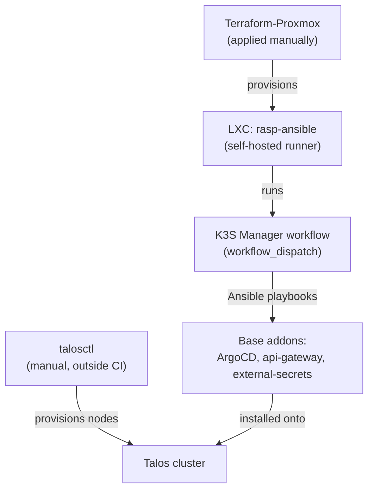

# Cluster bootstrap

See [Kubernetes Cluster (Talos)](../architecture/cluster.md) for the topology
and the full step-by-step. This document covers the infrastructure around
the cluster — what exists before and outside of Kubernetes.

## Self-hosted runner

The addon and maintenance automation (`homelab-bootsrap-k3s`) runs on a
GitHub Actions self-hosted runner — a dedicated Raspberry Pi
(`rasp-ansible`) — instead of a GitHub-hosted runner, since the Ansible
playbooks need direct access to the internal network (`192.168.1.0/24`)
where the cluster nodes live.

## The runner's LXC (`Terraform-Proxmox`)

The runner itself is provisioned as infrastructure: an LXC on Proxmox,
created via Terraform (`Terraform-Proxmox`, consuming the
[`iac-proxmox-lxc`](modules.md#iac-proxmox-lxc) module):

- Ubuntu 22.04, static IP (`192.168.1.50/24`)
- Tags `github-runner`, `ubuntu`
- Runner setup inside the container done by `provision.sh`, via
  `remote-exec`

Unlike the ECR stack, this `Terraform-Proxmox` is applied manually (local
`terraform apply`) — there's no equivalent Terragrunt stack in
`iac.homelab-live-infra/proxmox/` yet.

## Bootstrap chain summary

