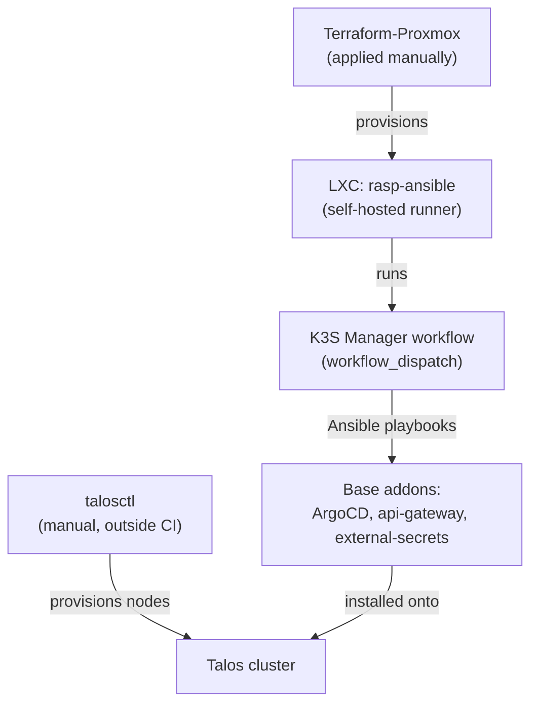

# Cluster bootstrap

See [Kubernetes Cluster (Talos)](../architecture/cluster.md) for the topology
and the full step-by-step. This document covers the infrastructure around
the cluster — what exists before and outside of Kubernetes.

## IaC pipeline identities (out of band)

The roles the Tier-1 pipeline assumes to run `terragrunt` are **not** managed by
Terragrunt — that would be a chicken-and-egg (the `apply` role would rewrite its
own trust policy while assumed). They live in
`iac.homelab-live-infra/bootstrap/bootstrap.sh`, an idempotent AWS-CLI script run
with admin credentials:

- **`gha-cmoreira-dev-iac-plan`** — `ReadOnlyAccess` + state access; assumed by
  `plan` (PRs) and `drift`.
- **`gha-cmoreira-dev-iac-apply`** — `AdministratorAccess`; assumed only by
  `apply.yml` on a push to `main`.
- The GitHub Actions **OIDC provider** (shared with the image-push role).

The image-push role (`iac-aws-ecr-pipeline`) and everything else stay in
Terragrunt — nothing in the pipeline assumes them, so no chicken-and-egg.

## Self-hosted runner (decommissioned)

!!! warning "`rasp-ansible` is no longer operational"
    The `homelab-bootsrap-k3s` workflows (`K3S Manager`, `Fleet Maintenance`)
    still reference this runner but won't run until a replacement exists. Org CI
    now has hosted runners only — which **can't reach the LAN**. Hence
    `proxmox/**` in Tier 1 is local-only, and Burrito (in-cluster) is the only
    automated path to the internal network.

Historically the addon/maintenance automation ran on a dedicated Raspberry Pi
(`rasp-ansible`) — the Ansible playbooks need direct access to the internal
network (`192.168.1.0/24`) where the cluster nodes live.

## The runner's LXC (`Terraform-Proxmox`)

The runner itself is provisioned as infrastructure: an LXC on Proxmox,
created via Terraform (`Terraform-Proxmox`, consuming the
[`iac-proxmox-lxc`](modules.md#iac-proxmox-lxc) module):

- Ubuntu 22.04, static IP (`192.168.1.50/24`)
- Tags `github-runner`, `ubuntu`
- Runner setup inside the container done by `provision.sh`, via
  `remote-exec`

This `Terraform-Proxmox` is applied manually (local `terraform apply`). The
`proxmox/**` layers in `iac.homelab-live-infra` are also local-only, for the
same reason (LAN unreachable from CI).

## Bootstrap chain summary

How the cluster was originally built (the `rasp-ansible` step is currently
stopped — see above):

