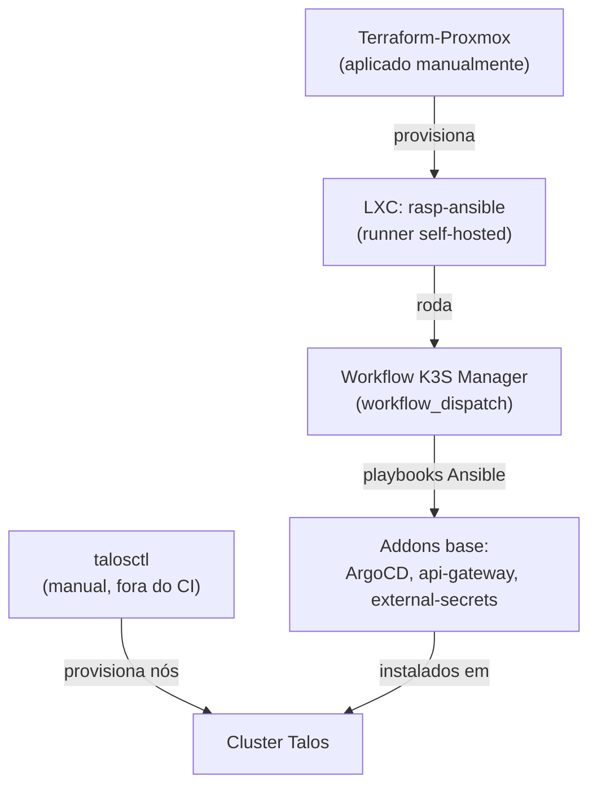

# Bootstrap do cluster

Ver [Cluster Kubernetes (Talos)](../architecture/cluster.md) para a topologia e
o passo a passo completo. Este documento cobre a parte de infraestrutura ao
redor do cluster — o que existe antes e fora do Kubernetes.

## Runner self-hosted

A automação de addons e manutenção (`homelab-bootsrap-k3s`) roda num runner
self-hosted do GitHub Actions — um Raspberry Pi dedicado (`rasp-ansible`) — em
vez de num runner hospedado pela GitHub, já que os playbooks Ansible precisam
de acesso direto à rede interna (`192.168.1.0/24`) onde os nós do cluster
vivem.

## O LXC do runner (`Terraform-Proxmox`)

O próprio runner é provisionado como infraestrutura: um LXC no Proxmox, criado
via Terraform (`Terraform-Proxmox`, consumindo o módulo
[`iac-proxmox-lxc`](modules.md#iac-proxmox-lxc)):

- Ubuntu 22.04, IP estático (`192.168.1.50/24`)
- Tags `github-runner`, `ubuntu`
- Setup do runner dentro do container feito por `provision.sh`, via
  `remote-exec`

Diferente do stack de ECR, este `Terraform-Proxmox` é aplicado manualmente
(`terraform apply` local) — não há stack Terragrunt equivalente em
`iac.homelab-live-infra/proxmox/` ainda.

## Resumo da cadeia de bootstrap

