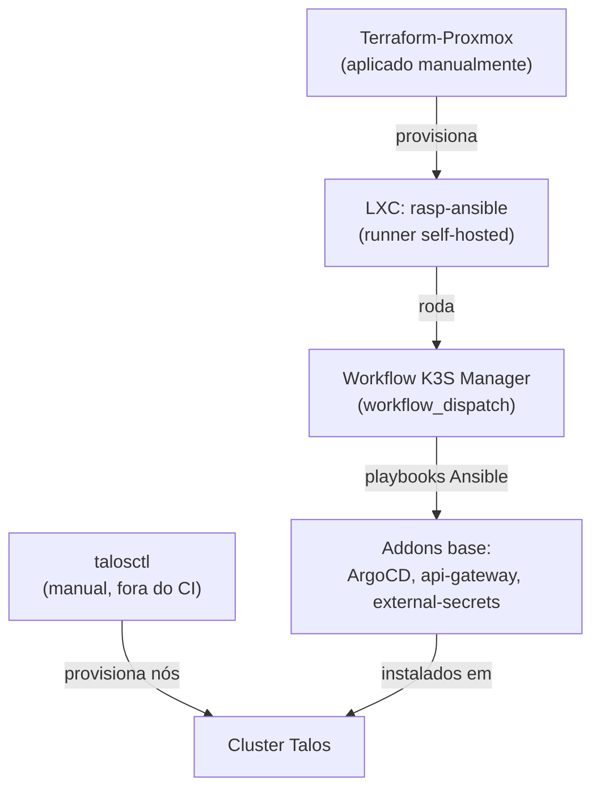

# Bootstrap do cluster

Ver [Cluster Kubernetes (Talos)](../architecture/cluster.md) para a topologia e
o passo a passo completo. Este documento cobre a parte de infraestrutura ao
redor do cluster — o que existe antes e fora do Kubernetes.

## Identidades do pipeline de IaC (out of band)

As roles que o pipeline do Tier 1 assume para rodar `terragrunt` **não** são
geridas por Terragrunt — seria um chicken-egg (a role de `apply` reescreveria a
própria trust policy enquanto assumida). Vivem em
`iac.homelab-live-infra/bootstrap/bootstrap.sh`, um script AWS CLI idempotente
rodado com credencial admin:

- **`gha-cmoreira-dev-iac-plan`** — `ReadOnlyAccess` + acesso ao state; assumida
  por `plan` (PRs) e `drift`.
- **`gha-cmoreira-dev-iac-apply`** — `AdministratorAccess`; assumida só pelo
  `apply.yml` num push na `main`.
- O **OIDC provider** do GitHub Actions (compartilhado com a role de push de
  imagem).

A role de push de imagem (`iac-aws-ecr-pipeline`) e todo o resto continuam no
Terragrunt — nada do pipeline as assume, então não há chicken-egg.

## Runner self-hosted (descomissionado)

!!! warning "`rasp-ansible` não está mais em operação"
    Os workflows de `homelab-bootsrap-k3s` (`K3S Manager`, `Fleet Maintenance`)
    ainda referenciam esse runner, mas não rodam até haver um substituto. O CI
    da org só tem runners hospedados agora — que **não alcançam a LAN**. Por isso
    `proxmox/**` no Tier 1 é local-only, e o Burrito (in-cluster) é o único
    caminho automatizado até a rede interna.

Historicamente, a automação de addons/manutenção rodava num Raspberry Pi
dedicado (`rasp-ansible`) — os playbooks Ansible precisam de acesso direto à
rede interna (`192.168.1.0/24`) onde os nós do cluster vivem.

## O LXC do runner (`Terraform-Proxmox`)

O próprio runner é provisionado como infraestrutura: um LXC no Proxmox, criado
via Terraform (`Terraform-Proxmox`, consumindo o módulo
[`iac-proxmox-lxc`](modules.md#iac-proxmox-lxc)):

- Ubuntu 22.04, IP estático (`192.168.1.50/24`)
- Tags `github-runner`, `ubuntu`
- Setup do runner dentro do container feito por `provision.sh`, via
  `remote-exec`

Este `Terraform-Proxmox` é aplicado manualmente (`terraform apply` local). As
camadas `proxmox/**` em `iac.homelab-live-infra` também são local-only, pelo
mesmo motivo (LAN inacessível pelo CI).

## Resumo da cadeia de bootstrap

Como o cluster foi construído originalmente (o passo `rasp-ansible` está hoje
parado — ver acima):

