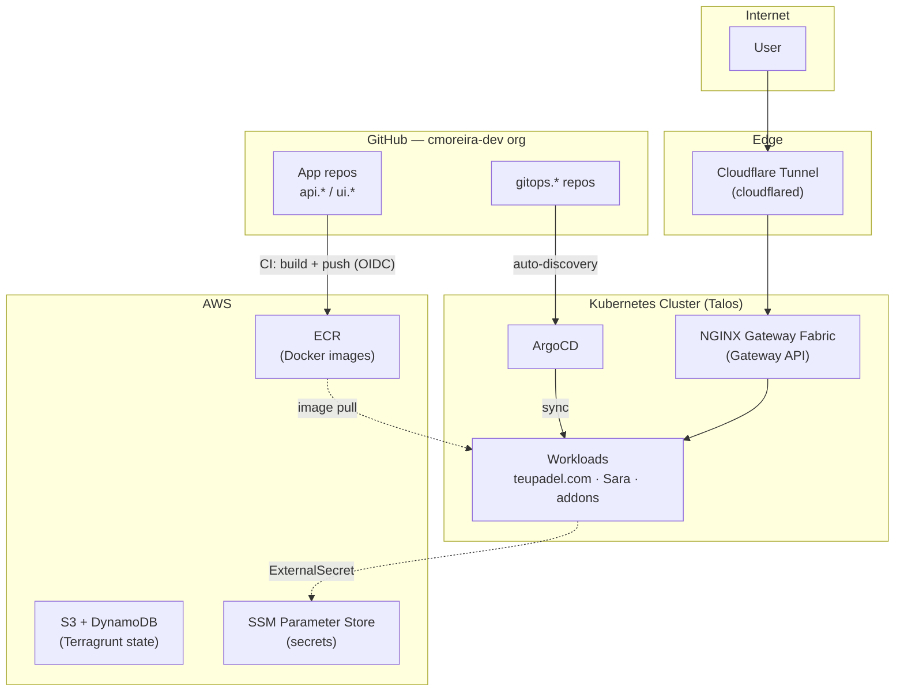

# HomeLab — cmoreira.dev

Documentation for the infrastructure, platform, and applications of the
**cmoreira-dev** organization: a personal homelab operated with the same
practices as a production environment — versioned IaC, GitOps, a real
Kubernetes cluster, and CI/CD pipelines with federated identity (no static
credentials).

## How the organization is divided

The GitHub org follows a category-based structure, one folder = one set of
related repositories:

| Category | Contents |
|---|---|
| `infra-as-code/` | Terraform/Terragrunt — provisioning of live infrastructure (AWS, Proxmox) |
| `platform-engineering/` | Cluster addons and GitOps (ArgoCD), internal developer portal (Backstage) |
| `teupadel.com/` | AI-powered padel movement analysis application |
| `sara/` | Personal chords/lyrics practice application |
| `documentation/` | This site |

See [Repository Patterns](repos.md) for the naming convention (`gitops.*`,
`iac.*`, `api.*`, `ui.*`, `docs.*`) and the expected internal structure of each
repo type.

## Architecture in one picture

Each layer of this picture has its own page:

- **[Kubernetes Cluster](architecture/cluster.md)** — Talos, bootstrap, GPU addons
- **[Networking & Ingress](architecture/networking.md)** — Cloudflare Tunnel, Gateway API, routing
- **[Secrets & Security](architecture/secrets.md)** — External Secrets, OIDC, no static credentials
- **[Terragrunt](iac/terragrunt.md)** — AWS infrastructure managed as code
- **[GitOps pattern](gitops/pattern.md)** — how a `git push` becomes a running workload
- **[Build & Registry](cicd/build-registry.md)** — Docker image pipeline

## Applications running today

| App | What it is | Stack | Repos |
|---|---|---|---|
| [teupadel.com](apps/teupadel.md) | AI-powered padel movement analysis (video upload → LLM-generated feedback) | Next.js SSR, FastAPI, pose estimation (ONNX), Claude | `ui.ia.teupadel.com`, `api.ia.teupadel.com`, `api.ia.pose-estimation`, `gitops.teupadel.com` |
| [Sara](apps/sara.md) | Chords/lyrics player with BPM-driven auto-scroll | Next.js, FastAPI (scraper) | `ui.ia.local-sara`, `api.ia.local-sara`, `gitops.local-sara` |

## Principles behind this infra

- **Everything declarative**: infrastructure in Terragrunt, workloads in
  Helm/Kustomize — no manual `kubectl apply` or `terraform apply` outside of
  one-time bootstrap.
- **Real GitOps**: ArgoCD is the only thing that applies manifests to the
  cluster; a `git push` on a `gitops.*` repo is the entire deploy mechanism.
- **No static credentials**: CI uses OIDC (GitHub Actions → AWS IAM), workloads
  use External Secrets (AWS SSM) — no long-lived secret ever needs to be
  copied manually.
- **Convention over configuration**: the repo name's prefix (`gitops.`, `api.`,
  `ui.`, `iac.`) already tells you what it does and how it's operated — see
  [Repository Patterns](repos.md).
