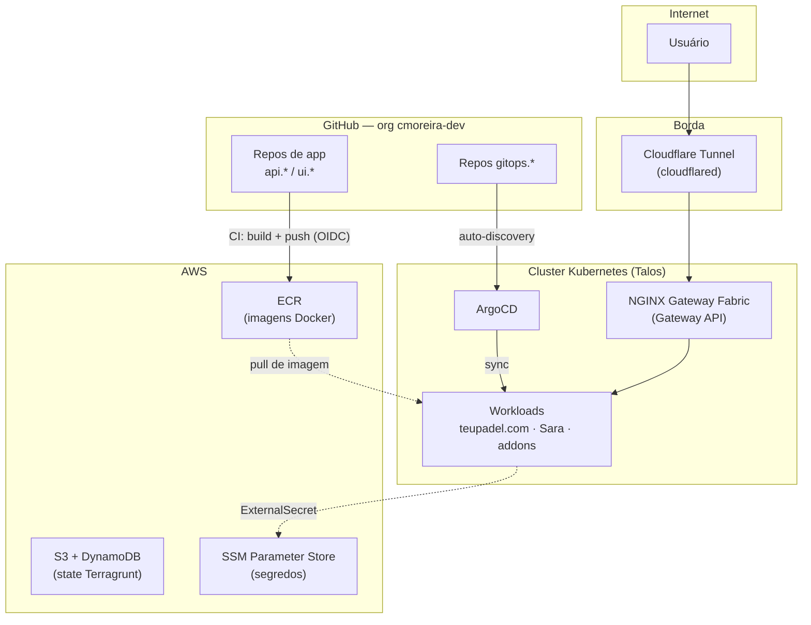

# HomeLab — cmoreira.dev

Documentação da infraestrutura, plataforma e aplicações da organização
**cmoreira-dev**: um homelab pessoal operado com as mesmas práticas de um ambiente
de produção — IaC versionado, GitOps, cluster Kubernetes real e pipelines de CI/CD
com identidade federada (sem credenciais estáticas).

## Como a organização está dividida

O GitHub da org segue uma estrutura por categorias, uma pasta = um conjunto de
repositórios relacionados:

| Categoria | Conteúdo |
|---|---|
| `infra-as-code/` | Terraform/Terragrunt — provisionamento de infraestrutura viva (AWS, Proxmox) |
| `platform-engineering/` | Addons de cluster e GitOps (ArgoCD), portal interno (Backstage) |
| `teupadel.com/` | Aplicação de análise de movimento de padel com IA |
| `sara/` | Aplicação pessoal de prática de cifras/letras |
| `documentation/` | Este site |

Ver [Padrões de Repositório](repos.md) para a convenção de nomes (`gitops.*`,
`iac.*`, `api.*`, `ui.*`, `docs.*`) e a estrutura interna esperada de cada tipo.

## Arquitetura em uma imagem

Cada camada dessa imagem tem uma página própria:

- **[Cluster Kubernetes](architecture/cluster.md)** — Talos, bootstrap, addons de GPU
- **[Rede & Ingress](architecture/networking.md)** — Cloudflare Tunnel, Gateway API, roteamento
- **[Secrets & Segurança](architecture/secrets.md)** — External Secrets, OIDC, sem credenciais estáticas
- **[Terragrunt](iac/terragrunt.md)** — infraestrutura AWS gerenciada como código
- **[Padrão GitOps](gitops/pattern.md)** — como um `git push` vira workload rodando
- **[Build & Registry](cicd/build-registry.md)** — pipeline de imagens Docker

## Aplicações rodando hoje

| App | O que é | Stack | Repos |
|---|---|---|---|
| [teupadel.com](apps/teupadel.md) | Análise de movimento de padel com IA (upload de vídeo → feedback gerado por LLM) | Next.js SSR, FastAPI, pose estimation (ONNX), Claude | `ui.ia.teupadel.com`, `api.ia.teupadel.com`, `api.ia.pose-estimation`, `gitops.teupadel.com` |
| [Sara](apps/sara.md) | Player de cifras/letras com auto-scroll por BPM | Next.js, FastAPI (scraper) | `ui.ia.local-sara`, `api.ia.local-sara`, `gitops.local-sara` |

## Princípios que guiam esta infra

- **Tudo declarativo**: infraestrutura em Terragrunt, workloads em Helm/Kustomize —
  sem `kubectl apply` ou `terraform apply` manual fora de bootstrap único.
- **GitOps de verdade**: o ArgoCD é a única coisa que aplica manifests no cluster; um
  `git push` num repo `gitops.*` é o mecanismo de deploy inteiro.
- **Sem credenciais estáticas**: CI usa OIDC (GitHub Actions → AWS IAM), workloads
  usam External Secrets (AWS SSM) — nenhum segredo de longa duração precisa ser
  copiado manualmente.
- **Convenção antes de configuração**: o prefixo do nome do repo (`gitops.`, `api.`,
  `ui.`, `iac.`) já diz o que ele faz e como é operado — ver
  [Padrões de Repositório](repos.md).
